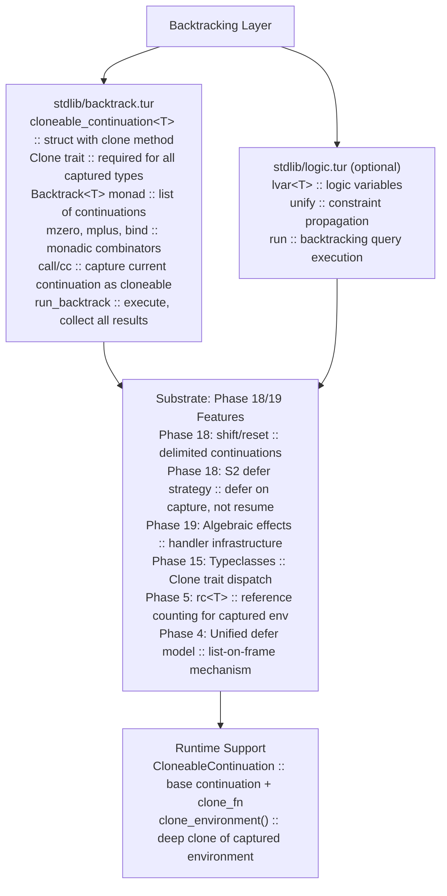

# Backtracking with Cloneable Continuations — Design & Implementation Plan

> **Status:** Draft Plan
> **Last Updated:** 2026-05-10
> **Phase:** Post-Phase 19 (v2 stretch goal)
> **Cross-references:** [turmeric-plan.md](turmeric-plan.md) §18 (Delimited continuations), §19 (Algebraic effects), [effects-plan.md](effects-plan.md) §6.3 (Multi-shot continuations)

---

## Executive Summary

This document outlines the design and implementation of **cloneable continuations** to enable backtracking computation in Turmeric. Backtracking is a control flow paradigm where the program systematically explores multiple computation paths, automatically undoing state changes when a path fails.

**Key insight:** Phase 18's delimited continuations (`shift`/`reset`) provide the substrate. Phase 19's algebraic effects provide the handler infrastructure. Cloneable continuations extend this by allowing continuations to be **duplicated and resumed multiple times**, enabling backtracking parsers, constraint solvers, and logic programming systems.

**Core challenge:** Turmeric's ownership model (`ref<T>`, `defer`) assumes linear consumption. Multi-shot continuations require **cloning captured state** — every value in the continuation's environment must implement a `Clone` trait. This is gated behind a `cloneable<continuation<T>>` type.

**Sequencing:** Depends on Phase 18 (delimited continuations) and Phase 19 (algebraic effects v1). Target: **Phase 20+**.

---

## 1. Motivation: Why Backtracking?

Backtracking enables a declarative programming style where the system automatically explores alternatives:

| Use Case | Example | Benefit |
|---------|---------|---------|
| **Parsing** | Parser combinators (e.g., `parseA \| parseB`) | Clean, composable grammar definitions |
| **Logic Programming** | miniKanren-style relational queries | Bidirectional computation (input→output or output→input) |
| **Constraint Solving** | Sudoku, SAT solvers | Automatic search with pruning |
| **Probabilistic Programming** | Bayesian inference | Explore multiple execution paths with weights |
| **Game AI** | Decision trees, move exploration | Try multiple strategies, backtrack on failure |

### 1.1 Current Limitation

Phase 18/19 continuations are **one-shot**: `resume k v` consumes `k`, making it unusable afterward. This matches Turmeric's ownership model but **precludes backtracking**.

From [effects-plan.md §6.3](effects-plan.md):
> If multi-shot is ever needed (backtracking parsers, probabilistic programming), gate it behind a `cloneable<continuation>` type that requires every captured value's type to implement a `Clone` trait.

This document fleshes out that design.

---

## 2. Design Overview

### 2.1 Core Abstraction: Cloneable Continuations

```turmeric
;; A cloneable continuation can be resumed multiple times
;; Requires all captured values to implement Clone
defalias cloneable_continuation<T>
  (struct
    [k : continuation<T>
     clone : (-> cloneable_continuation<T>)])

;; Surface syntax (sugar)
(defsyntax cloneable-reset [body]
  (reset (fn [] body) :cloneable true))

(defsyntax cloneable-shift [k [args] body]
  (shift k (fn [k] body) :cloneable true))
```

### 2.2 The Clone Trait

```turmeric
;; Every type captured by a cloneable continuation must implement Clone
(defclass Clone [a]
  (clone [x : a] : a))

;; Primitive implementations
definstance Clone int64
  (clone [x] x))  ;; ints are Copy

definstance Clone bool
  (clone [x] x))

definstance Clone cstr
  (clone [x] x))

;; Derived implementations require deep clone
definstance Clone (Pair a b) [Clone a, Clone b]
  (clone [x]
    (Pair::new (Clone::clone x.first) (Clone::clone x.second))))

definstance Clone (Vector a) [Clone a]
  (clone [x]
    (Vector::map Clone::clone x))
```

### 2.3 Backtracking Monad

```turmeric
;; A backtracking computation yields zero or more results
defalias Backtrack<T> (-> (list (-> T)))

;; Core operators
defn mzero [] : (Backtrack a)
  []

defn mplus [^Clone a fs gs : (Backtrack a)] : (Backtrack a)
  (fn [k] (fs k) ++ (gs k))

defn bind [^Clone a b f : (-> a (Backtrack b)) xs : (Backtrack a)] : (Backtrack b)
  (fn [k] (xs (fn [x] (f x k))))

defn return [x : a] : (Backtrack a)
  (fn [k] [k x])
```

---

## 3. Architecture



---

## 4. Type System Integration

### 4.1 Cloneable Continuation Type

```turmeric
;; A continuation that can be resumed multiple times
;; Parameterized by return type T
;; All captured types must satisfy Clone
defalias cloneable_continuation<T>
  (exists [env : CloneEnv]
    (struct
      [k : (continuation<T> :env)
       env : env
       clone : (-> cloneable_continuation<T>)]))

;; CloneEnv: a type environment where all types implement Clone
;; This is enforced at elaboration time
```

### 4.2 Elaborator Changes

The elaborator must verify that all types captured by a `cloneable-reset` implement `Clone`:

```c
// In src/elab.c
static bool check_cloneable_capture(Expr* shift_expr, TypeEnv* env) {
    // Walk the captured environment
    for (Binding* b = shift_expr->captured_env; b; b = b->next) {
        Type* t = b->type;
        // Check if type implements Clone
        if (!type_implements_trait(t, "Clone", env)) {
            elab_error(shift_expr->span, 
                       "Type %s captured by cloneable continuation does not implement Clone",
                       type_to_string(t));
            return false;
        }
        // Recursively check type arguments
        if (!check_type_cloneable(t, env)) {
            return false;
        }
    }
    return true;
}
```

### 4.3 Clone Trait Resolution

```c
// In src/types.c
bool type_implements_clone(Type* t) {
    switch (t->kind) {
        case TY_PRIMITIVE:
            // int64, bool, cstr are always cloneable
            return true;
        case TY_STRUCT:
            // Check all fields implement Clone
            for (int i = 0; i < t->struct_type.field_count; i++) {
                if (!type_implements_clone(t->struct_type.fields[i].type)) {
                    return false;
                }
            }
            return true;
        case TY_VARIANT:
            // Check all alternatives implement Clone
            for (int i = 0; i < t->variant.alternative_count; i++) {
                if (!type_implements_clone(t->variant.alternatives[i].type)) {
                    return false;
                }
            }
            return true;
        case TY_GENERIC:
            // Look up instance in typeclass environment
            return typeclass_instance_exists(t, "Clone");
        default:
            return false;
    }
}
```

---

## 5. Runtime Implementation

### 5.1 Continuation Representation

```c
// In src/continuation.c
typedef struct Continuation {
    bool is_cloneable;
    
    // For one-shot continuations (Phase 18)
    ContinuationFn resume;
    void* captured_env;
    
    // For cloneable continuations
    CloneFn clone;
    DropFn drop;
} Continuation;

typedef struct CloneableContinuation {
    Continuation base;
    // Additional metadata for cloning
    size_t env_size;
    CloneEnvEntry* env_entries;  // Array of (value, clone_fn) pairs
} CloneableContinuation;
```

### 5.2 Cloning a Continuation

```c
// Deep clone the captured environment
Continuation* continuation_clone(Continuation* k) {
    assert(k->is_cloneable);
    
    CloneableContinuation* ck = (CloneableContinuation*)k;
    CloneableContinuation* new_ck = malloc(sizeof(CloneableContinuation));
    
    // Clone the base continuation (stack frames, etc.)
    *new_ck = *ck;
    
    // Deep clone each captured value
    new_ck->env_entries = malloc(ck->env_size * sizeof(CloneEnvEntry));
    for (size_t i = 0; i < ck->env_size; i++) {
        CloneEnvEntry* old = &ck->env_entries[i];
        CloneEnvEntry* new = &new_ck->env_entries[i];
        new->value = old->clone_fn(old->value);
        new->clone_fn = old->clone_fn;
        new->drop_fn = old->drop_fn;
    }
    
    return (Continuation*)new_ck;
}
```

### 5.3 Resuming a Cloneable Continuation

```c
// Resume a cloneable continuation
// Unlike one-shot, this does NOT consume the continuation
Value* continuation_resume_cloneable(Continuation* k, Value* arg) {
    assert(k->is_cloneable);
    
    // Save current stack/state
    ExecutionState saved_state = save_current_state();
    
    // Restore continuation's state
    restore_state(k->saved_state);
    
    // Push arg onto stack
    push_value(arg);
    
    // Resume execution
    Value* result = execute_until_completion();
    
    // Restore original state (continuation state is preserved)
    restore_state(saved_state);
    
    return result;
}
```

### 5.4 Defer Behavior with Cloneable Continuations

**Critical design decision:** When a cloneable continuation is resumed, defers **must not fire** on scope exit during replay. Instead:

1. **On first capture:** Defers are **suspended** (not executed)
2. **On clone:** Defers are **copied** into the cloned continuation
3. **On resume:** Defers **remain suspended** — they only fire when the *original* scope exits

This ensures idempotent replay. If a defer absolutely must run on each resume, it must be explicitly marked:

```turmeric
;; Normal defer - runs once when original scope exits
(defer (println "cleanup"))

;; Replay defer - runs on each resume (use with caution!)
(defer :replay true (println "repeated cleanup"))
```

---

## 6. Standard Library API

### 6.1 Core Backtracking (stdlib/backtrack.tur)

```turmeric
;; Create a cloneable continuation
(defn call/cc* [^Clone a f : (-> (cloneable_continuation a) a)] : a
  (cloneable-shift k
    (f k)))

;; Run a backtracking computation, collect all results
(defn run_backtrack [^Clone a m : (Backtrack a)] : (list a)
  (let [results (ref (list::nil : (list a)))]
    (m (fn [x] (ref/mutate! results (fn [xs] (list::cons x xs)))))
    (ref/read results)))

;; Run with depth limit (prevent infinite search)
(defn run_backtrack_depth [^Clone a depth : int, m : (Backtrack a)] : (list a)
  (let [results (ref (list::nil : (list a)))
        depth_ref (ref depth)]
    (letrec [run [m : (Backtrack a)]
             (fn [k]
               (if (<= (ref/read depth_ref) 0)
                 []
                 (do
                   (ref/mutate! depth_ref (fn [d] (max 0 (dec d))))
                   (m (fn [x]
                        (ref/mutate! depth_ref (fn [d] (inc d)))
                        (k x))))))]
      (run m (fn [x] (ref/mutate! results (fn [xs] (list::cons x xs))))))
    (ref/read results)))

;; Choice: try first branch, backtrack to second on failure
(defn choice [^Clone a x y : (Backtrack a)] : (Backtrack a)
  (mplus x y))

;; Guard: only succeed if condition holds
(defn guard [^Clone a cond : bool, m : (Backtrack a)] : (Backtrack a)
  (if cond m mzero))

;; Fresh: generate fresh values for backtracking
(defn fresh [^Clone a n : int, f : (-> int (Backtrack a))] : (Backtrack a)
  (letrec [go [i : int] : (Backtrack a)
           (if (>= i n)
             mzero
             (mplus (f i) (go (inc i))))]
    (go 0)))
```

### 6.2 Logic Programming Integration (stdlib/logic.tur)

```turmeric
;; Logic variables
(defstruct LVar [id : int])

;; Unification state
(defstruct UState
  [subst : (Map LVar Term)  ;; Substitution: LVar -> Term
   counter : int])           ;; For generating fresh LVars

;; Terms (can contain LVars)
(defalias Term
  (variant
    INT int64
    BOOL bool
    SYM cstr
    VAR LVar
    PAIR (Pair Term Term)
    NIL unit))

;; Goal: a backtracking computation that may bind LVars
(defalias Goal (Backtrack UState))

;; Unification
(defn unify [x : Term, y : Term] : Goal
  (cloneable-shift k
    (match [x y]
      [(Term::INT a) (Term::INT b)] (if (= a b) (k (UState::new)) mzero)
      [(Term::VAR v) t] (unify_var v t k)
      [t (Term::VAR v)] (unify_var v t k)
      [(Term::PAIR a b) (Term::PAIR c d)] (unify a c (unify b d k))
      [_ _] mzero)))

;; Fresh logic variable
(defn fresh [f : (-> LVar Goal)] : Goal
  (cloneable-shift k
    (let [state (UState::new)]
      (let [v (LVar::new state.counter)]
        (f v (k state))))))

;; Conjunction (AND)
(defn conjoined [g1 g2 : Goal] : Goal
  (bind g1 (fn [_] g2)))

;; Disjunction (OR) - backtracks
(defn disjoined [g1 g2 : Goal] : Goal
  (mplus g1 g2))

;; Run a logic query
(defn run_logic [n : int, g : Goal] : (list UState)
  (run_backtrack_depth n g))
```

### 6.3 Parser Combinators (stdlib/parsec.tur)

```turmeric
;; Parser type: consumes input, produces result with remaining input
(defalias Parser<a> (-> Input (Backtrack (Pair a Input))))

;; Basic parsers
(defn pure [^Clone a x : a] : (Parser a)
  (fn [input] (return (Pair::new x input))))

(defn fail [] : (Parser a)
  (fn [_] mzero))

(defn item [] : (Parser Char)
  (fn [input]
    (match input
      [(Input::Cons c rest)] (return (Pair::new c rest))
      [(Input::Nil)] mzero)))

;; Combinators
(defn bind_parser [^Clone a b p : (Parser a), f : (-> a (Parser b))] : (Parser b)
  (fn [input]
    (bind (p input)
          (fn [Pair::Pair x rest]] (f x rest)
           [_] mzero))))

(defn or_parser [^Clone a p q : (Parser a)] : (Parser a)
  (fn [input] (mplus (p input) (q input))))

(defn then [^Clone a b p : (Parser a), q : (Parser b)] : (Parser b)
  (bind_parser p (fn [_] q)))

(defn many [^Clone a p : (Parser a)] : (Parser (list a))
  (letrec [many_go [] : (Parser (list a))
           (or_parser (then (bind_parser p (fn [x] (bind_parser (many_go) (fn [xs] (return (list::cons x xs))))))
                          (pure (list::nil : (list a)))))
           ]
    many_go))

;; Run a parser
(defn run_parser [^Clone a p : (Parser a), input : Input] : (list (Pair a Input))
  (run_backtrack (p input)))
```

### 6.4 Worked Example: Parser Backtracking

The example below shows why cloneable continuations are needed: the first branch consumes input and then fails, so the parser must rewind and try the second branch from the original input position.

```turmeric
;; Parse a specific character
(defn char [expected : Char] : (Parser Char)
  (bind_parser (item)
    (fn [c]
      (if (= c expected)
        (pure c)
        (fail)))))

;; Parse the string "ab"
(defn parse_ab [] : (Parser cstr)
  (bind_parser (char 'a')
    (fn [_]
      (bind_parser (char 'b')
        (fn [_]
          (pure "ab"))))))

;; Parse the string "ac"
(defn parse_ac [] : (Parser cstr)
  (bind_parser (char 'a')
    (fn [_]
      (bind_parser (char 'c')
        (fn [_]
          (pure "ac"))))))

;; Choice with backtracking
(defn parse_ab_or_ac [] : (Parser cstr)
  (or_parser (parse_ab) (parse_ac)))

;; Input: "ac"
;; 1) parse_ab consumes 'a', then expects 'b' and fails at 'c'
;; 2) backtrack restores original input
;; 3) parse_ac runs from the same start position and succeeds
(defn test-parser-backtracking []
  (let [result (run_parser (parse_ab_or_ac) (Input::from_string "ac"))]
    (assert (= (list::length result) 1))
    (let [Pair::Pair value rest] (list::head result)]
      (assert (= value "ac"))
      (assert (Input::equal rest (Input::from_string ""))))))
```

Without cloneable continuations, the failed `parse_ab` branch would consume the continuation and prevent retrying `parse_ac` from the same checkpoint.

---

## 7. Compilation Strategy

### 7.1 CPS Transformation for Cloneable Continuations

Cloneable continuations use a modified CPS transformation that preserves the continuation environment:

```c
// In src/codegen.c
static Value* emit_cloneable_shift(Expr* expr, BasicBlock* bb) {
    // Capture current environment with clone annotations
    Value* env = emit_capture_environment(expr, bb, true);  // true = cloneable
    
    // Create continuation struct with clone function
    Value* cont = emit_create_cloneable_continuation(env, bb);
    
    // Pass to shift body
    Value* body_result = emit_expr(expr->shift_body, bb);
    
    // Return result
    return body_result;
}
```

### 7.2 Selective CPS for Cloneable Blocks

Only code within `cloneable-reset` blocks needs special handling:

```c
// In src/analysis.c
static bool needs_cloneable_cps(Expr* expr) {
    switch (expr->kind) {
        case EX_CLONEABLE_RESET:
            return true;
        case EX_CLONEABLE_SHIFT:
            return true;
        default:
            // Check children
            for (int i = 0; i < expr->child_count; i++) {
                if (needs_cloneable_cps(expr->children[i])) {
                    return true;
                }
            }
            return false;
    }
}
```

---

## 8. Testing Strategy

### 8.1 Unit Tests (tests/backtrack/)

```turmeric
;; tests/backtrack/basic.tur
(defn test-choice []
  (let [result (run_backtrack
                 (choice (return 1) (return 2)))]
    (assert (list::has? result 1))
    (assert (list::has? result 2))))

(defn test-mzero []
  (let [result (run_backtrack mzero : int)]
    (assert (list::empty? result))))

(defn test-bind []
  (let [result (run_backtrack
                 (bind (choice (return 1) (return 2))
                       (fn [x] (return (inc x)))))]
    (assert (list::has? result 2))
    (assert (list::has? result 3))))
```

### 8.2 Logic Programming Tests (tests/backtrack/logic.tur)

```turmeric
(defn test-unify []
  (let [v (LVar::new 0)]
    (let [result (run_logic 100
                             (fresh (fn [_] (unify (Term::VAR v) (Term::INT 42)))))]
      (assert (= (list::length result) 1))
      (let [state (list::head result)]
        (let [val (Map::lookup state.subst v)]
          (assert (= val (Term::INT 42))))))))
```

### 8.3 Parser Tests (tests/backtrack/parsec.tur)

```turmeric
(defn test-parser-choice []
  (let [p (or_parser (char 'a') (char 'b'))]
    (let [result (run_parser p (Input::from_string "a"))]
      (assert (= (list::length result) 1))
      (let [Pair::Pair c rest] (list::head result)]
        (assert (= c 'a'))
        (assert (Input::equal rest (Input::from_string "")))))))

(defn test-parser-many []
  (let [p (many (char 'a'))]
    (let [result (run_parser p (Input::from_string "aaa"))]
      (assert (= (list::length result) 1))
      (let [Pair::Pair chars rest] (list::head result)]
        (assert (= (list::length chars) 3))
        (assert (Input::equal rest (Input::from_string "")))))))
```

### 8.4 Performance Tests

```turmeric
;; Measure cloning overhead
(defn bench-clone-overhead []
  (let [n 10000]
    (let [start (time::now)]
      (letrec [loop [i : int]
               (if (= i 0)
                 ()
                 (let [k (cloneable-reset (fn [] i))]
                   (let [_ (continuation::clone k)]
                     (loop (dec i)))))]
        (loop n))
      (let [end (time::now)]
        (println (time::diff end start))))))
```

---

## 9. Implementation Phases

### Phase 1: Clone Trait Infrastructure (2-3 days)
- [ ] Add `Clone` typeclass to stdlib/typeclass.tur
- [ ] Implement Clone for primitive types (int, bool, cstr)
- [ ] Implement Clone for Pair, Vector, Map, etc.
- [ ] Add clone method to rc<T> (increments refcount)
- [ ] Add clone method to ref<T> (deep clone of contents)

### Phase 2: Cloneable Continuation Type (3-4 days)
- [ ] Define `cloneable_continuation<T>` type in runtime
- [ ] Add :cloneable flag to shift/reset expressions
- [ ] Implement continuation_clone() in runtime
- [ ] Add cloneable continuation support to CPS transformation
- [ ] Elaborator check for Clone constraint on captured types

### Phase 3: Backtracking Monad (2 days)
- [ ] Implement Backtrack<T> type and combinators (mzero, mplus, bind, return)
- [ ] Implement run_backtrack and run_backtrack_depth
- [ ] Add choice, guard, fresh helpers

### Phase 4: Standard Library Integration (3-5 days)
- [ ] Implement stdlib/logic.tur (logic programming)
- [ ] Implement stdlib/parsec.tur (parser combinators)
- [ ] Add convenience functions for common patterns

### Phase 5: Testing & Optimization (3 days)
- [ ] Write unit tests for all components
- [ ] Performance benchmarking
- [ ] Memory usage analysis
- [ ] Documentation

**Total estimated effort:** 13-17 days

---

## 10. Open Questions & Tradeoffs

### 10.1 Question: Deep vs Shallow Clone

| Approach | Pros | Cons |
|----------|------|------|
| **Deep clone** | True independence between clones | Higher memory usage, slower |
| **Copy-on-write** | Sharing until mutation | Complex implementation, needs GC |
| **Path copying** | Balance: copy only modified paths | Complex, needs per-value version tracking |

**Decision:** Start with deep clone (simplest, most correct). Optimize to copy-on-write later if profiling shows it's a bottleneck.

### 10.2 Question: Defer Semantics

| Option | Semantics | Use Case |
|--------|-----------|----------|
| **Suspend all defers** | Defers only fire on original scope exit | Pure backtracking, idempotent |
| **Clone defers** | Each clone gets its own defer queue | Resource cleanup on each path |
| **Explicit annotation** | User marks which defers to clone | Maximum control |

**Decision:** Suspend all defers by default, with explicit `:replay` annotation for opt-in cloning.

### 10.3 Question: Integration with Effects

Should cloneable continuations integrate with Phase 19's effect handlers?

| Option | Description | Complexity |
|--------|-------------|------------|
| **Separate systems** | Cloneable conts are independent | Lower, but less composable |
| **Effect-based** | Cloneable conts as an effect | Higher, but unified with effects |
| **Hybrid** | Cloneable conts work with and without effects | Medium, best of both worlds |

**Decision:** Hybrid approach. Cloneable continuations work standalone, but can also be used within effect handlers.

---

## 11. Related Work

| System | Approach | Language |
|--------|----------|----------|
| **Racket** | `continuation?` + `continuation-copy` | Scheme |
| **Koka** | Multi-shot continuations via effects | JavaScript-like |
| **Eff** | Effect handlers with cloneable state | Haskell/ML |
| **miniKanren** | Implicit backtracking via streams | Scheme |
| **Wren** | Fibers with cloneable state | Smalltalk-like |

---

## 12. References

1. [effects-plan.md §6.3](effects-plan.md) — Multi-shot continuations discussion
2. [turmeric-plan.md §18](turmeric-plan.md) — Delimited continuations (Phase 18)
3. [turmeric-plan.md §19](turmeric-plan.md) — Algebraic effects (Phase 19)
4. [copy-borrow-move-lifetimes.md](copy-borrow-move-lifetimes.md) — Clone trait design
5. Felleisen, Friedman, et al. — "The Scheme Requests for Implementation" (SRFI)
6. Byrd — "The Reasoned Schemer" — miniKanren logic programming
7.Mariani, Moggi — "A categorical semantics for Probabilistic Lambda Calculus"
