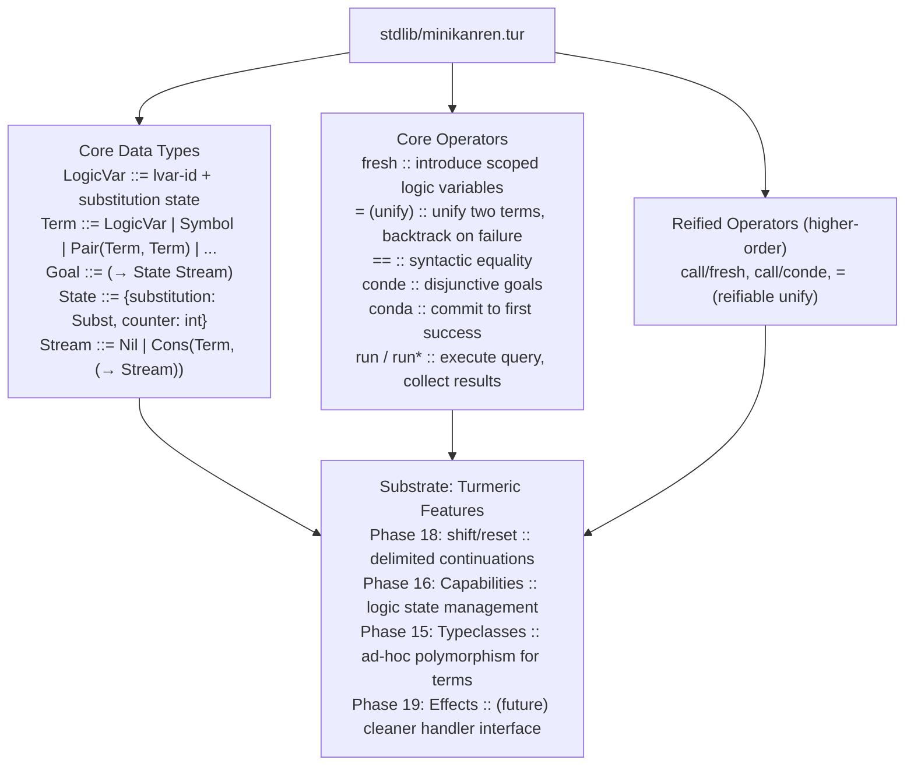

# MiniKanren for Turmeric — Design & Implementation Plan

> A logic programming system (à la miniKanren / microKanren) built on Turmeric's
> delimited continuations, capabilities, and typeclass infrastructure.

---

## Overview

**Goal:** Embed a relational/logic programming paradigm in Turmeric by implementing
a miniKanren-style DSL. This enables *bidirectional* programming: run programs
forward (function → output) or backward (output → inputs that produce it).

**Why Turmeric?** Turmeric's Phase 18 delimited continuations (`shift`/`reset`) and
Phase 19 algebraic effects provide the perfect substrate. miniKanren's core
`conda`/`conde`/etc. operators map naturally to delimited continuations.
Capability passing (Phase 16) gives us a clean way to handle the logic variable
state.

**Key insight:** miniKanren needs only ~150 lines of Scheme. In Turmeric, we
expect ~200-300 lines of core implementation in `stdlib/minikanren.tur`,
plus typeclass-based integration with Turmeric's type system.

---

## Background: miniKanren

miniKanren is a minimalist logic programming language embedded in Scheme.
Core concepts:

```scheme
; Logic variables (lvars) - placeholders for unknown values
; Goals - predicates that constrain lvars
; Relations - functions that return goals
; Stream of answers - lazy sequence of solutions

; Core operators:
; (conde (goal1) (goal2) ...) - try each goal, interleaving
; (fresh (x y ...) goal) - introduce fresh logic variables
; (= x y) or (unify x y) - unify two terms
; (== x y) - syntactic equality (no unify)
; (run n (q ...) body) - run query, return up to n results
```

---

## Architecture



---

## Type Design

### Core Types (stdlib/minikanren.tur)

```turmeric
;; Logic variable - internally a unique ID + indirection cell
(defstruct LogicVar
  [id : int
   deref : (ptr (option Term))])  ;; ptr for in-place mutation

;; Term - the fundamental data structure of logic programming
;; Uses Turmeric's existing option and pair types
(defalias Term
  (variant
    LVAR    LogicVar
    SYM     cstr
    INT     int64
    BOOL    bool
    PAIR    (Pair Term Term)
    NIL     unit))

;; Substitution - mapping from logic vars to terms
;; Implemented as a persistent hash array mapped trie (HAMT)
;; for efficient composition and lookup
(defstruct Subst
  [map : (ptr Hamt)])  ;; Hamt from stdlib/hamt.tur

;; State - the complete logic programming state
(defstruct State
  [subst : Subst
   counter : int      ;; for generating fresh var IDs
   constraints : (Vector Constraint)])  ;; optional: CLP extensions

;; Stream of solutions - lazy, potentially infinite
(defalias Stream
  (variant
    SNil
    SCons Term (-> Stream)))

;; Goal - a function from state to stream of states
(defalias Goal (-> State Stream))

;; Constraint for CLP-style extensions (optional, Phase 2)
(defstruct Constraint
  [var : LogicVar
   check : (-> Term bool)])  ;; predicate that term must satisfy
```

### Typeclass Integration

```turmeric
;; Walkable typeclass - for unifying composite data structures
(defclass Walkable [a]
  (walk [x : a, s : Subst] : a))

;; Unifiable typeclass - for terms that can be unified
(defclass Unifiable [a]
  (unify [x : a, y : a, s : Subst] : (option Subst)))

;; Freshable typeclass - for generating fresh logic variables
(defclass Freshable [a]
  (fresh [x : a, state : State] : (Pair a State)))

;; Implement Unifiable for Term
definstance Unifiable Term
  (unify [x y s] ...)

;; Implement Walkable for Term
definstance Walkable Term
  (walk [x s] ...)

;; Implement Walkable for Pair
definstance Walkable (Pair a b) [Walkable a, Walkable b]
  (walk [x s]
    (Pair. (walk x.fst s) (walk x.snd s)))
```

---

## Core Implementation

### Phase 1: Foundation (MVP - ~1 week)

#### 1.1 Logic Variables and Substitution

```turmeric
;; stdlib/minikanren.tur

(ns minikanren)

;; Create a fresh logic variable
defn lvar [state : State] : (Pair LogicVar State)
  (let [id state.counter]
    (let [state' (State. state.subst (inc id) state.constraints)]
      (Pair. (LogicVar. id null) state')))

;; Dereference a logic variable through the substitution
;; Follows the "deref chain" until we hit a non-variable
defn deref [v : LogicVar, s : Subst] : Term
  (case (Hamt.get s.map v.id)
    (some term) (deref-term term s)
    none (LVAR v))

(defn deref-term [t : Term, s : Subst] : Term
  (match t
    (LVAR v) (deref v s)
    _ t))
```

#### 1.2 Unification

```turmeric
;; Core unification algorithm
;; Returns option of updated substitution on success
(defn unify [x : Term, y : Term, s : Subst] : (option Subst)
  (let [x' (deref-term x s)]
    (let [y' (deref-term y s)]
      (unify-derefed x' y' s)))

(defn unify-derefed [x : Term, y : Term, s : Subst] : (option Subst)
  (match (x, y)
    ((SYM a, SYM b)) (if (== a b) (some s) none)
    ((INT a, INT b)) (if (== a b) (some s) none)
    ((BOOL a, BOOL b)) (if (== a b) (some s) none)
    ((NIL, NIL)) (some s)
    ((LVAR v, _) (unify-var v y s))
    ((_, LVAR v) (unify-var v x s))
    ((PAIR a b, PAIR c d) 
      (case (unify a c s)
        none none
        (some s1) (unify b d s1)))
    _ none))

(defn unify-var [v : LogicVar, y : Term, s : Subst] : (option Subst)
  (let [y' (deref-term y s)]
    (match y'
      (LVAR w) (if (== v.id w.id) (some s) (some (extend-subst s v y')))
      _ (if (occurs-check v y' s) none (some (extend-subst s v y')))))

;; Check if logic variable occurs in term (for occurs check)
defn occurs-check [v : LogicVar, t : Term, s : Subst] : bool
  (match (deref-term t s)
    (LVAR w) (== v.id w.id)
    (PAIR a b) (or (occurs-check v a s) (occurs-check v b s))
    _ false)

;; Extend substitution with a new binding
defn extend-subst [s : Subst, v : LogicVar, t : Term] : Subst
  (Subst. (Hamt.set s.map v.id t))
```

#### 1.3 State Management via Capabilities

```turmeric
;; Use capability passing for state management
;; This allows clean separation of pure logic from stateful operations

(defstruct LogicState
  [subst : Subst
   counter : int])

defclass LogicStateCap [c]
  (get-state : (-> c LogicState)
   set-state : (-> c LogicState unit))

;; Real implementation
defstruct RealLogicState [subst : Subst, counter : int]

definstance LogicStateCap RealLogicState
  (get-state [c] (LogicState. c.subst c.counter))
  (set-state [c state] (do (set! c.subst state.subst) (set! c.counter state.counter))))

;; Test/mock implementation for testing
defstruct TestLogicState [initial : LogicState, log : (Vector string)]
```

#### 1.4 Goals and Combinators

```turmeric
;; Goal type alias
(defalias Goal (-> LogicState Stream))

;; Success goal - always succeeds with current state
(defn succeed [_ : LogicState] : Stream
  (SCons unit (fn [_] (SCons unit ...))))  ;; TODO: proper stream

;; Failure goal - always fails
(defn fail [_ : LogicState] : Stream SNil)

;; Conjunction - try all goals in sequence (AND)
(defn conja [gs : (Vector Goal)] : Goal
  (fn [state]
    (case (length gs)
      0 (succeed state)
      1 ((first gs) state)
      _ (let [first-g (first gs)]
          (let [rest-gs (slice gs 1 none)]
            (bind-stream (first-g state) 
              (fn [state'] ((conja rest-gs) state'))))))))

;; Disjunction - try each goal, interleaving results (OR)
;; This is where shift/reset comes in for backtracking
(defn conde [gs : (Vector Goal)] : Goal
  (fn [state]
    (let [interleave (fn [s1 s2] ...)]
      (reduce interleave SNil (map (fn [g] (g state)) gs)))))

;; M-plus: fair interleaving combinator
(defn mplus [s1 : Stream, s2 : (-> Stream)] : Stream
  (match s1
    SNil (s2)
    (SCons x f) (SCons x (fn [] (mplus (f) s2)))))

;; Bind for streams (like flatMap)
(defn bind-stream [s : Stream, f : (-> LogicState Stream)] : Stream
  (match s
    SNil SNil
    (SCons state rest) (mplus (f state) (fn [] (bind-stream (rest) f)))))
```

#### 1.5 Fresh Variables

```turmeric
;; Introduce fresh logic variables
(defn fresh [vars : (Vector cstr), body : Goal] : Goal
  (fn [state]
    (let [new-state (foldl (fn [st _] (lvar st)) state vars)]
      ;; new-state has updated counter, need to extract it
      (body new-state))))

;; Reified fresh for higher-order
(defn call-fresh [c : (-> (Vector cstr) Goal), vars : (Vector cstr)] : Goal
  (fresh vars (c vars)))
```

#### 1.6 Equality and Unification Goals

```turmeric
;; Syntactic equality (no unification)
(defn == [x : Term, y : Term] : Goal
  (fn [state]
    (if (term-equal x y state.subst)
      (SCons state (fn [] SNil))
      SNil)))

;; Unification goal
(defn = [x : Term, y : Term] : Goal
  (fn [state]
    (case (unify x y state.subst)
      none SNil
      (some new-subst) (SCons (LogicState. new-subst state.counter) (fn [] SNil)))))

(defn term-equal [x : Term, y : Term, s : Subst] : bool
  (match (deref-term x s, deref-term y s)
    ((SYM a, SYM b)) (== a b)
    ((INT a, INT b)) (== a b)
    ((BOOL a, BOOL b)) (== a b)
    ((NIL, NIL)) true
    ((PAIR a b, PAIR c d)) (and (term-equal a c s) (term-equal b d s))
    _ false))
```

#### 1.7 Running Queries

```turmeric
;; Run a query and return up to n results
(defn run [n : int, q : Goal] : (Vector LogicState)
  (let [stream (q (LogicState. (empty-subst) 0))]
    (take n (stream-to-vector stream))))

;; Run and return all results (may not terminate!)
(defn run* [q : Goal] : (Vector LogicState)
  (run infinity q))

;; Helper to convert stream to vector
defn stream-to-vector [s : Stream] : (Vector LogicState)
  (match s
    SNil (Vector.empty)
    (SCons x f) (Vector.cons x (stream-to-vector (f)))))

;; Take first n elements from stream
defn take [n : int, s : Stream] : (Vector LogicState)
  (if (<= n 0) (Vector.empty)
    (match s
      SNil (Vector.empty)
      (SCons x f) (Vector.cons x (take (dec n) (f)))))
```

### Phase 2: Delimited Continuations Backtracking (~1 week)

This is where we leverage Turmeric's `shift`/`reset` for proper backtracking.

```turmeric
;; Better conde using shift/reset for backtracking
(defn conde [goals : (Vector Goal)] : Goal
  (fn [state]
    (reset
      (let [interleave-goals 
            (fn [gs]
              (match gs
                [] SNil
                [g . rest] 
                  (mplus (g state) 
                         (fn [] (shift k (fn [] (interleave-goals rest)))))))]
        (interleave-goals goals)))))

;; condi - interleaving version (fair)
(defn condi [goals : (Vector Goal)] : Goal
  (conde goals))  ;; same as conde in our implementation

;; conda - all (commit to first success, no backtracking)
(defn conda [goals : (Vector Goal)] : Goal
  (fn [state]
    (match goals
      [] (succeed state)
      [g . rest] 
        (mplus (g state) (fn [] (conda rest state))))))

;; condw - wave (depth-first, left-to-right)
(defn condw [goals : (Vector Goal)] : Goal
  (fn [state]
    (match goals
      [] (fail state)
      [g . rest] 
        (mplus (g state) (fn [] (condw rest state))))))
```

### Phase 3: Reification and Higher-Order (Optional, ~1 week)

```turmeric
;; Reified goal combinators
;; These allow goals to be passed as first-class values

defn call-conde [goals : (Vector Goal)] : Goal
  (conde goals)

defn call-fresh* [f : (-> (Vector Term) Goal), args : (Vector Term)] : Goal
  (fresh args (apply f args)))

;; Reified unification
(defn call-== [x : Term, y : Term] : Goal
  (== x y))

defn call-= [x : Term, y : Term] : Goal
  (= x y))

;; Application - apply a relation to arguments
(defn call [rel : (-> ... Goal), args : (Vector Term)] : Goal
  (apply rel args))
```

### Phase 4: Standard Relations Library (stdlib/minikanren/rel.tur)

```turmeric
(ns minikanren.rel)

;; Symbol relations
(defn symbolo [x : Term] : Goal
  (fresh [y]
    (== x (SYM y))))

(defn symbol? [x : cstr, y : Term] : Goal
  (== x (SYM y)))

;; Number relations
(defn numbero [x : Term] : Goal
  (fresh [y]
    (or (== x (INT y)) (== x (BOOL y)))))

(defn integero [x : Term] : Goal (== x (INT _)))
(defn booleano [x : Term] : Goal (== x (BOOL _)))

;; Pair relations
(defn pair? [x : Term, y : Term, z : Term] : Goal
  (= x (PAIR y z)))

(defn pairo [x : Term] : Goal
  (fresh [y z]
    (= x (PAIR y z))))

;; List relations (using pairs and nil)
(defn listo [x : Term] : Goal
  (conde
    [(== x NIL)]
    [(fresh [h t] (= x (PAIR h t)) (listo t))]))

(defn cons? [h : Term, t : Term, l : Term] : Goal
  (= l (PAIR h t)))

(defn car? [x : Term, l : Term] : Goal
  (= (PAIR x _) l))

defn cdr? [x : Term, l : Term] : Goal
  (= (PAIR _ x) l))

;; Member relation (classic logic programming example)
(defn membero [x : Term, l : Term] : Goal
  (conde
    [(car? x l)]
    [(fresh [d] (cdr? d l) (membero x d))]))

;; Append relation
(defn appendo [l : Term, s : Term, out : Term] : Goal
  (conde
    [(== l NIL) (= s out)]
    [(fresh [h t l2]
       (car? h l)
       (cdr? t l)
       (= l2 (PAIR h l2))
       (appendo t s l2)
       (= out (PAIR h l2)))])))

;; Reverse relation
(defn reverseo [l : Term, out : Term] : Goal
  (appendo l NIL out))

;; Assoc (property list lookup)
(defn assoc [k : cstr, v : Term, alist : Term] : Goal
  (fresh [h t key val]
    (= alist (PAIR (PAIR key val) t))
    (conde
      [(== k key) (= v val)]
      [(assoc k v t)])))
```

---

## Typeclass-Based Term Extension

Allow user-defined types to participate in logic programming:

```turmeric
;; Typeclass for types that can be converted to/from Term
(defclass ToTerm [a]
  (to-term [x : a] : Term)
  (from-term [x : Term] : (option a)))

;; Example: define ToTerm for int
definstance ToTerm int
  (to-term [x] (INT x))
  (from-term [t]
    (match (deref-term t)
      (INT n) (some n)
      _ none)))

;; Lift any ToTerm type to work in relations
defn term [x : a] : Term
  (to-term x)

;; Pattern matching for terms
defn match-term [t : Term]
  (macro [clauses]
    ;; expand to match on deref-term
    ...)
```

---

## Integration with Turmeric Effects (Phase 19+)

When Phase 19 algebraic effects land, we can provide a cleaner interface:

```turmeric
;; Define a logic effect
defeffect Logic [state : LogicState] : LogicState

;; Perform unification as an effect
(defn unify-e [x : Term, y : Term] : Goal
  (perform (Logic (fn [state] (= x y state)))))

;; Handle with custom state
(defn run-with-handle [n : int, q : Goal, handler : Handler] : (Vector LogicState)
  (handle (q initial-state) handler))
```

---

## Testing Strategy

### Unit Tests (tests/minikanren/)

```turmeric
;; test/minikanren/basic.tur
(ns-test minikanren.basic)

(defn test-succeed-fail []
  (assert-equal (run 5 succeed) [initial-state])
  (assert-equal (run 5 fail) []))

(defn test-unification []
  (let [x (lvar)]
    (let [results (run 1 (== x x))]
      (assert (== (length results) 1))))
  
  (let [x (lvar) y (lvar)]
    (let [results (run 1 (= x y))]
      (assert (== (length results) 1)))))

(defn test-membero []
  (let [l (PAIR (SYM "a") (PAIR (SYM "b") (PAIR (SYM "c") NIL)))]
    (let [results (run* (fresh [x] (membero x l)))]
      (assert (== (length results) 3))
      (assert (member? (SYM "a") (map get-x results)))
      (assert (member? (SYM "b") (map get-x results)))
      (assert (member? (SYM "c") (map get-x results))))))
```

### Property-Based Tests

Use Turmeric's test framework with capability-based mocking:

```turmeric
;; Verify that unification is symmetric
(defn test-unify-symmetric []
  (for-all [t1 term-generator]
    (for-all [t2 term-generator]
      (assert-equal (unify t1 t2) (unify t2 t1)))))

;; Verify that conde is commutative for deterministic goals
(defn test-conde-commutative []
  (for-all [g1 goal-generator]
    (for-all [g2 goal-generator]
      (let [r1 (run* (conde [g1 g2]))]
        (let [r2 (run* (conde [g2 g1]))]
          (assert (set-equal r1 r2)))))))
```

---

## Performance Considerations

### Stream Representation

The naive linked-list stream representation may be too slow for serious use.
Options:

1. **Chunked streams** - batch results in chunks of N
2. **Trampolined streams** - use trampolines for stack safety
3. **Lazy vectors** - build results incrementally

```turmeric
;; Chunked stream for better performance
defn chunked-stream [chunk-size : int, g : Goal, state : LogicState] : Stream
  (let [chunk (Vector.with-capacity chunk-size)]
    (let [fill-chunk (fn [s n]
                       (if (>= n chunk-size) (some (Vector.freeze chunk))
                         (case (g s)
                           SNil (some (Vector.freeze chunk))
                           (SCons s' rest) 
                             (do (Vector.push chunk s')
                                 (fill-chunk s' (inc n))))))]
      (case (fill-chunk state 0)
        none SNil
        (some v) (SCons v (fn [] (chunked-stream chunk-size g last-state)))))))
```

### Substitution Optimization

- Use **persistent hash maps** (HAMT) for O(log n) lookup/insert
- Implement **union-find** for equivalence classes
- Consider **copying garbage collection** for substitutions

---

## Implementation Roadmap

### Phase 1: MVP (2-3 weeks)

| Task | Priority | Status | Dependencies |
|------|----------|--------|--------------|
| Core type definitions (Term, Subst, State) | High | Pending | Typeclasses |
| Logic variable creation and dereferencing | High | Pending | Phase 15 |
| Basic unification algorithm | High | Pending | Core types |
| Simple goal combinators (succeed, fail) | High | Pending | Core types |
| conja (conjunction) | High | Pending | Goals |
| conde (disjunction) with basic interleave | High | Pending | Goals |
| Fresh variable introduction | High | Pending | State |
| Equality predicates (==, =) | High | Pending | Unification |
| Basic run/run* | High | Pending | Goals |
| Unit tests for MVP | High | Pending | All above |

**Exit criterion:** Can run classic examples like `membero`, `appendo` with correct results.

### Phase 2: Backtracking (1-2 weeks)

| Task | Priority | Status | Dependencies |
|------|----------|--------|--------------|
| Integrate shift/reset for proper backtracking | High | Pending | Phase 18 |
| Fix conde to use delimited continuations | High | Pending | shift/reset |
| Add conda (all), condi (interleave) | Medium | Pending | conde |
| Add condw (wave) | Medium | Pending | conde |
| Stress tests with large search spaces | Medium | Pending | Backtracking |

**Exit criterion:** Backtracking works correctly; can solve constraint satisfaction problems.

### Phase 3: Reification (1 week)

| Task | Priority | Status | Dependencies |
|------|----------|--------|--------------|
| Reified goal combinators | Medium | Pending | Phase 2 |
| Higher-order relations | Medium | Pending | Reification |
| Typeclass integration for user types | Medium | Pending | Phase 15 |
| stdlib/rel.tur with standard relations | Medium | Pending | All above |

**Exit criterion:** Can define and use higher-order relations; user types work in logic programs.

### Phase 4: Polish (1-2 weeks)

| Task | Priority | Status | Dependencies |
|------|----------|--------|--------------|
| Performance optimization (chunked streams) | Medium | Pending | Phase 3 |
| Better error messages for unification failures | Low | Pending | Phase 3 |
| Documentation and examples | Medium | Completed (initial tutorial + example) | Phase 3 |
| Property-based tests | Medium | Pending | Phase 3 |
| Integration with Phase 19 effects | Low | Pending | Phase 19 |

**Exit criterion:** miniKanren is usable, well-tested, and documented.

---

## Example: Solving Logic Puzzles

```turmeric
;; Classic "who owns the fish" puzzle
(defn fish-puzzle [] : (Vector map)
  (run* (fresh [nationality drink pet color number]
          (membero nationality ["English" "Spanish" "Japanese" "Ukrainian" "Norwegian"])
          (membero drink ["tea" "coffee" "milk" "orange-juice" "water"])
          (membero pet ["dog" "snails" "fox" "horse" "zebra"])
          (membero color ["red" "green" "white" "yellow" "blue"])
          (membero number [1 2 3 4 5])
          
          ;; Constraints:
          (== (first nationality) "English")
          (== (first color) "red")
          (== (second pet) "dog")
          (== (second drink) "coffee")
          (== (first drink) "tea")
          ;; ... more constraints
          
          (== pet "fish"))))
```

---

## File Structure

```
stdlib/
├── minikanren/
│   ├── core.tur          # Core types and basic operations
│   ├── unify.tur         # Unification algorithms
│   ├── goals.tur         # Goal combinators
│   ├── state.tur         # State management (capability-based)
│   ├── run.tur           # Query execution
│   ├── rel/
│   │   ├── list.tur      # List relations
│   │   ├── arithmetic.tur # Arithmetic relations
│   │   ├── string.tur    # String relations
│   │   └── ...
│   └── minikanren.tur    # Main export module
└── ...

tests/
└── minikanren/
    ├── basic.tur         # Basic functionality tests
    ├── unify.tur         # Unification tests
    ├── backtrack.tur     # Backtracking tests
    ├── reification.tur   # Reification tests
    └── puzzles.tur       # Logic puzzle examples

docs/
└── guides/
    └── minikanren-tutorial.md   # User-facing tutorial

examples/
└── minikanren/
    ├── CMakeLists.txt
    └── src/
        └── main.tur
```

---

## Success Criteria

- [ ] Classic miniKanren examples (membero, appendo, etc.) work correctly
- [ ] Backtracking produces correct, complete results
- [ ] Performance is acceptable for moderate-sized problems (100s of solutions)
- [ ] Typeclass integration allows user-defined types in relations
- [ ] Clean integration with Turmeric's existing features
- [ ] Well-documented with examples

---

## Risks and Mitigations

| Risk | Probability | Impact | Mitigation |
|------|-------------|--------|------------|
| shift/reset not ready | Medium | High | Implement fallback using exceptions + explicit stack |
| Performance too slow | Medium | Medium | Profile early, optimize hot paths |
| Stack overflow on deep recursion | High | Medium | Use trampolines or CPS for streams |
| Memory leaks from substitutions | Medium | High | Use Turmeric's ref/rc for automatic management |
| Complex interactions with ref/rc | Medium | Medium | Document ownership semantics clearly |

---

## References

- [miniKanren official site](http://minikanren.org/)
- [The Reasoned Schemer](https://www.cs.indiana.edu/~dyb/pubs/2005-qig.pdf) - tutorial
- [miniKanren in Scheme (150 lines)](https://github.com/miniKanren/miniKanren)
- [microKanren](https://github.com/jewertow/microKanren) - even smaller variant
- [Kanren: A Minimalist Logic Programming Language](https://arxiv.org/abs/1405.4400)
- [Delimited Continuations in Scheme](https://scheme-requests-for-implementation.schemers.org/src/srfi-199/srfi-199.html)

---

## Appendix: Quick Reference

| miniKanren | Turmeric miniKanren | Purpose |
|------------|--------------------|---------|
| `(fresh (x) ...)` | `(fresh [x] ...)` | Introduce fresh lvar |
| `(= x y)` | `(= x y)` | Unify x and y |
| `(== x y)` | `(== x y)` | Syntactic equality |
| `(conde (g1) (g2))` | `(conde [g1 g2])` | Disjunction |
| `(conda (g1) (g2))` | `(conda [g1 g2])` | All (no backtrack) |
| `(run n (q ...) ...)` | `(run n (fresh [q] ...))` | Run query |
| `(run* (q ...) ...)` | `(run* (fresh [q] ...))` | Run, all results |
