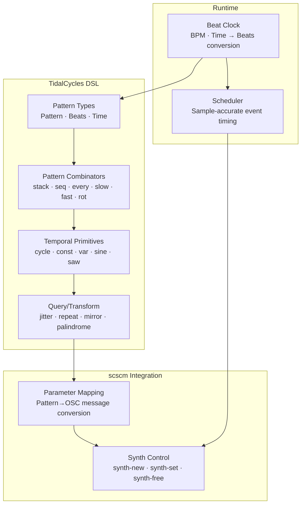

# TidalCycles-like DSL for Turmeric — Pattern Library Plan

> **Status**: Draft / Proposal  
> **Target**: Phase 20+ (Post-algebraic effects)  
> **Dependencies**: Phase 2 FFI, scscm library (hclang/scscm), Phase 19 algebraic effects (for timing)  
> **Related**: [scscm-hcsynth-livecoding-plan.md](./scscm-hcsynth-livecoding-plan.md), [signal-processing-arrows-plan.md](./signal-processing-arrows-plan.md)  

---

## 1. Overview

### 1.1 Goals

| Goal | Priority | Success Criterion |
|---|---|---|
| TidalCycles-inspired pattern DSL | High | Pattern combinators (stack, seq, every, etc.) working |
| Time-aware pattern evaluation | High | Patterns evaluate correctly based on beat clock |
| Integration with scscm | High | Patterns can drive synth parameters in hcsynth |
| Live-coding friendly | High | Patterns can be modified and re-evaluated in REPL |
| Type-safe pattern composition | Medium | Type system enforces valid pattern combinations |
| Zero-allocation hot path | Medium | Pattern evaluation doesn't allocate in inner loop |
| Polyrhythm support | Low | Nested patterns with different time scales |

### 1.2 Architecture Summary



### 1.3 Key Design Decisions

| Decision | Choice | Rationale |
|---|---|---|
| Time representation | `Beats` (float) as primary | Matches TidalCycles, composer-friendly |
| Pattern type | `Pattern<T>` as function `Beats → T` | Simple, composable, lazy |
| Evaluation model | Pull-based (on demand) | Easier to integrate, no background threads |
| Polyrhythm | Nested patterns with time scaling | Matches TidalCycles semantics |
| Randomness | `Random` effect + seedable RNG | Reproducible patterns, effect-based |

---

## 2. Phase Breakdown

### 2.1 Phase A — Core Pattern Types

**Goal**: Establish the fundamental pattern type and time representation.

**Prerequisites**: None (can start immediately).

**Tasks**:

- [ ] Define time types in `stdlib/tidal/time.tur`:

```turmeric
;; Time representation
(def-type Beats float)      ;; Time in beats (1.0 = one beat)
(def-type Seconds float)    ;; Time in seconds
(def-type Samples int64)    ;; Time in samples (at current sample rate)

;; BPM utilities
(defn bpm->beats-per-sec [bpm : float] : float
  (/ bpm 60.0))

(defn bpm->sec-per-beat [bpm : float] : float
  (/ 60.0 bpm))

(defn beats->sec [beats : Beats bpm : float] : Seconds
  (* beats (bpm->sec-per-beat bpm)))

(defn sec->beats [sec : Seconds bpm : float] : Beats
  (* sec (bpm->beats-per-sec bpm)))
```

- [ ] Define the core `Pattern<T>` type:

```turmeric
;; A pattern is a function from time (in beats) to a value of type T
;; The time is the start time of the cycle the pattern is being evaluated for
(def-type Pattern<T> (fn [Beats] :T))

;; Type alias for numeric patterns (most common)
(def-type NumPattern (Pattern<float>))
```

- [ ] Define basic pattern constructors:

```turmeric
;; Constant pattern - always returns the same value
(defn const [value : T] : (Pattern<T>)
  (fn [_time : Beats] value))

;; Cycle through a list of values
(defn cycle [& values : (vec<T>)] : (Pattern<T>)
  (let [vec-values (vec values)]
    (fn [time : Beats]
      (let [index (mod (floor (* time 1.0)) (len vec-values))]
        (get vec-values index)))))

;; Get the current beat position within the cycle (0 to 1)
(defn phase [cycle-length : float = 1.0] : NumPattern
  (fn [time : Beats]
    (mod time cycle-length)))
```

- [ ] Define pattern application/shorthand:

```turmeric
;; Apply a pattern at a specific time (useful for testing)
(defn pat-at [p : (Pattern<T>) time : Beats] : T
  (p time))

;; Macro for cleaner pattern syntax
(defmacro P [& exprs]
  (cond
    (== (len exprs) 1) `(const ~(get exprs 0))
    :true `(cycle ~@exprs)))

;; Usage: (P 1 2 3) is equivalent to (cycle 1 2 3)
;;        (P 5) is equivalent to (const 5)
```

**Fixtures**:
- `tidal-time-basic.tur` — time conversion tests
- `tidal-pattern-const.tur` — constant pattern tests
- `tidal-pattern-cycle.tur` — cycle pattern tests

**Exit criterion**: Core types compile; basic patterns evaluate correctly.

---

### 2.2 Phase B — Temporal Pattern Combinators

**Goal**: Implement the core set of temporal transformation combinators.

**Tasks**:

- [ ] Time scaling combinators:

```turmeric
;; Slow down a pattern by a factor
(defn slow [factor : float p : (Pattern<T>)] : (Pattern<T>)
  (fn [time : Beats] (p (/ time factor))))

;; Speed up a pattern by a factor
(defn fast [factor : float p : (Pattern<T>)] : (Pattern<T>)
  (fn [time : Beats] (p (* time factor))))

;; Stretch time within a cycle
(defn stretch [factor : float p : (Pattern<T>)] : (Pattern<T>)
  (fn [time : Beats] (p (/ time factor))))

;; Compress time within a cycle
(defn compress [factor : float p : (Pattern<T>)] : (Pattern<T>)
  (fn [time : Beats] (p (* time factor))))
```

- [ ] Time shifting combinators:

```turmeric
;; Shift pattern in time
(defn shift [offset : Beats p : (Pattern<T>)] : (Pattern<T>)
  (fn [time : Beats] (p (+ time offset))))

;; Rotate the values in a cycle
(defn rot [amount : float p : (Pattern<T>)] : (Pattern<T>)
  (fn [time : Beats] (p (+ time amount))))

;; Mirror the pattern within its cycle
(defn mirror [p : (Pattern<T>)] : (Pattern<T>)
  (fn [time : Beats]
    (let [phase (mod time 2.0)]
      (if (< phase 1.0)
        (p phase)
        (p (- 2.0 phase))))))

;; Reverse time within each cycle
(defn rev [p : (Pattern<T>)] : (Pattern<T>)
  (fn [time : Beats]
    (let [phase (mod time 1.0)]
      (p (- 1.0 phase)))))
```

- [ ] Repetition combinators:

```turmeric
;; Repeat a pattern n times within its cycle
(defn repeat [n : int p : (Pattern<T>)] : (Pattern<T>)
  (fn [time : Beats] (p (* time n))))

;; Play the pattern once, then silence
(defn once [p : (Pattern<T>) zero : T] : (Pattern<T>)
  (fn [time : Beats]
    (if (< time 1.0) (p time) zero)))
```

**Fixtures**:
- `tidal-time-scaling.tur` — slow, fast, stretch, compress
- `tidal-time-shifting.tur` — shift, rot, mirror, rev
- `tidal-time-repeat.tur` — repeat, once

**Exit criterion**: All temporal combinators work correctly with test patterns.

---

### 2.3 Phase C — Structural Pattern Combinators

**Goal**: Implement combinators that combine multiple patterns structurally.

**Tasks**:

- [ ] Sequential combination:

```turmeric
;; Sequence patterns: play first, then second, then third, etc.
(defn seq [& patterns : (vec<(Pattern<T>))] : (Pattern<T>)
  (let [vec-patterns (vec patterns)]
    (fn [time : Beats]
      (let [total-length (len vec-patterns)
            index (mod (floor time) total-length)
            sub-time (- time (floor time))]
        ((get vec-patterns index) sub-time)))))

;; Sequence with custom lengths for each pattern
(defn seq-n [& pattern-lengths : (vec<tuple<(Pattern<T>) float>>)] : (Pattern<T>)
  (let [pairs (vec pattern-lengths)
        total-length (reduce + 0.0 (map #(snd %) pairs))]
    (fn [time : Beats]
      (let [mod-time (mod time total-length)
            ;; Find which segment we're in
            [index _ accumulated] (loop [i 0 acc 0.0]
                                    (if (or (== i (len pairs)) (>= mod-time acc))
                                      [i acc]
                                      (recur (inc i) (+ acc (snd (get pairs i))))))
            sub-time (- mod-time accumulated)
            scale (/ (snd (get pairs index)) total-length)]
        ((fst (get pairs index)) (/ sub-time scale))))))
```

- [ ] Parallel combination:

```turmeric
;; Stack patterns: play all simultaneously
(defn stack [& patterns : (vec<(Pattern<T>))] : (Pattern<(vec<T>)>)
  (fn [time : Beats]
    (vec (map #(% time) patterns))))

;; Stack with a combiner function
(defn stack-with [f : (fn [(vec<T>)] :U) & patterns : (vec<(Pattern<T>))] : (Pattern<U>)
  (fn [time : Beats]
    (f (vec (map #(% time) patterns)))))

;; Sum numeric patterns
(defn sum [& patterns : (vec<NumPattern>)] : NumPattern
  (apply stack-with (fn [v] (reduce + 0.0 v)) patterns))

;; Multiply numeric patterns
(defn multiply [& patterns : (vec<NumPattern>)] : NumPattern
  (apply stack-with (fn [v] (reduce * 1.0 v)) patterns))
```

- [ ] Conditional patterns:

```turmeric
;; Only play when condition is true (silence otherwise)
(defn when [cond : (Pattern<bool>) p : (Pattern<T>) zero : T] : (Pattern<T>)
  (fn [time : Beats]
    (if (cond time) (p time) zero)))

;; Play first pattern when condition is true, second when false
(defn if-pat [cond : (Pattern<bool>) then-p : (Pattern<T>) else-p : (Pattern<T>)] : (Pattern<T>)
  (fn [time : Beats]
    (if (cond time) (then-p time) (else-p time))))

;; Only play on certain beats
(defn every [n : int p : (Pattern<T>) zero : T] : (Pattern<T>)
  (when (fn [t] (== 0 (mod (floor (* t n)) n))) p zero))

;; Play on beats that are multiples of n
(defn nth [n : int p : (Pattern<T>) zero : T] : (Pattern<T>)
  (when (fn [t] (== 0 (mod (floor t) n))) p zero))

;; Euclidean rhythm pattern
(defn euclid [steps : int hits : int offset : int = 0] : NumPattern
  (fn [time : Beats]
    (let [phase (mod (floor (* time steps)) steps)
          hit? (>= (- (* hits (inc offset) phase) (floor (/ (* phase phase) 2)) steps hits offset)
          ;; Simplified: distribute hits evenly
          index (mod (floor (* time steps)) steps)
          pattern (loop [result (vec-replicate steps 0.0)
                         remaining hits
                         position 0]
                    (if (== remaining 0)
                      result
                      (recur (assoc result position 1.0)
                             (dec remaining)
                             (+ position (ceil (/ (- steps remaining) (inc remaining)))))))]
      (get pattern index))))
```

- [ ] Pattern selection:

```turmeric
;; Select from patterns based on index pattern
(defn select [index : (Pattern<int>) & patterns : (vec<(Pattern<T>))] : (Pattern<T>)
  (fn [time : Beats]
    (let [idx (mod (index time) (len patterns))]
      ((get patterns idx) time))))

;; First pattern that produces a non-zero value
(defn first-nonzero [zero : T & patterns : (vec<(Pattern<T>))] : (Pattern<T>)
  (fn [time : Beats]
    (loop [i 0]
      (if (== i (len patterns))
        zero
        (let [v ((get patterns i) time)]
          (if (!= v zero) v (recur (inc i))))))))
```

**Fixtures**:
- `tidal-struct-seq.tur` — seq, seq-n tests
- `tidal-struct-stack.tur` — stack, stack-with, sum, multiply tests
- `tidal-struct-cond.tur` — when, if-pat, every, nth tests
- `tidal-struct-euclid.tur` — euclid rhythm tests
- `tidal-struct-select.tur` — select, first-nonzero tests

**Exit criterion**: All structural combinators produce expected output.

---

### 2.4 Phase D — Value Transformation Combinators

**Goal**: Implement combinators that transform pattern values.

**Tasks**:

- [ ] Numeric transformations:

```turmeric
;; Add a constant or pattern to a numeric pattern
(defn add [p : NumPattern amount : (NumPattern :or: float)] : NumPattern
  (fn [time : Beats]
    (let [amt (if (float? amount) (const amount) amount)]
      (+ (p time) (amt time)))))

;; Multiply a numeric pattern
(defn mul [p : NumPattern factor : (NumPattern :or: float)] : NumPattern
  (fn [time : Beats]
    (let [f (if (float? factor) (const factor) factor)]
      (* (p time) (f time)))))

;; Range mapping
(defn range [p : NumPattern from-low : float from-high : float to-low : float to-high : float] : NumPattern
  (fn [time : Beats]
    (let [v (p time)
          normalized (/ (- v from-low) (- from-high from-low))
          clamped (math/clamp normalized 0.0 1.0)]
      (+ to-low (* clamped (- to-high to-low))))))

;; Clamp a pattern to a range
(defn clamp [p : NumPattern low : float high : float] : NumPattern
  (fn [time : Beats] (math/clamp (p time) low high)))
```

- [ ] Randomness and noise:

```turmeric
;; Add random jitter to a pattern
;; Uses Random effect for reproducibility
(defn jitter [p : (Pattern<T>) amount : float : T] : (Pattern<T>)
  (fn [time : Beats]
    (let [v (p time)]
      (if (float? v)
        (+ v (* (rand-float) amount))
        v))))

;; Randomly select from patterns
(defn rand-select [& patterns : (vec<(Pattern<T>))] : (Pattern<T>)
  (let [vec-patterns (vec patterns)]
    (fn [time : Beats]
      (let [idx (mod (rand-int (len vec-patterns)) (len vec-patterns))]
        ((get vec-patterns idx) time)))))

;; Perlin noise pattern
(defn noise [scale : float = 1.0 offset : float = 0.0] : NumPattern
  (fn [time : Beats]
    (* (perlin-noise (+ offset (* time scale))) 0.5)))

;; White noise
(defn white-noise [] : NumPattern
  (fn [_time : Beats] (rand-float)))
```

- [ ] Waveform patterns:

```turmeric
;; Sine wave pattern
(defn sine [freq : float = 1.0 amp : float = 1.0 phase : float = 0.0] : NumPattern
  (fn [time : Beats]
    (* amp (math/sin (+ phase (* time freq math/PI 2.0))))))

;; Square wave pattern
(defn square [freq : float = 1.0 amp : float = 1.0 duty : float = 0.5] : NumPattern
  (fn [time : Beats]
    (let [phase (mod (* time freq) 1.0)]
      (if (< phase duty) amp (- amp)))))

;; Sawtooth wave pattern
(defn saw [freq : float = 1.0 amp : float = 1.0] : NumPattern
  (fn [time : Beats]
    (* amp (- 1.0 (mod (* time freq) 1.0)))))

;; Triangle wave pattern
(defn tri [freq : float = 1.0 amp : float = 1.0] : NumPattern
  (fn [time : Beats]
    (let [phase (mod (* time freq) 1.0)]
      (* amp (if (< phase 0.5) (* 4.0 phase) (- 4.0 phase 2.0))))))
```

- [ ] Envelope patterns:

```turmeric
;; ADSR envelope as a pattern
(defn adsr [attack : float decay : float sustain : float release : float
            gate : (Pattern<bool>) = (const true)] : NumPattern
  (fn [time : Beats]
    (let [gate-on (gate time)
          total-time (* time (bpm->beats-per-sec 120.0))]
      (cond
        (not gate-on) 0.0
        (<= total-time attack) (/ total-time attack)
        (<= total-time (+ attack decay)) 
          (+ 1.0 (* -1.0 sustain (/ (- total-time attack) decay)))
        (<= total-time (+ attack decay release)) sustain
        :else (* sustain (/ (- (+ attack decay release) total-time) release))))))

;; Simple attack-release envelope
(defn ar [attack : float release : float gate : (Pattern<bool>) = (const true)] : NumPattern
  (fn [time : Beats]
    (let [gate-on (gate time)
          total-time (* time (bpm->beats-per-sec 120.0))]
      (cond
        (not gate-on) 0.0
        (<= total-time attack) (/ total-time attack)
        :else (- 1.0 (/ (- total-time attack) release))))))
```

**Fixtures**:
- `tidal-transform-arith.tur` — add, mul, range, clamp tests
- `tidal-transform-rand.tur` — jitter, rand-select, noise tests
- `tidal-transform-wave.tur` — sine, square, saw, tri tests
- `tidal-transform-envelope.tur` — adsr, ar tests

**Exit criterion**: All value transformations produce mathematically correct results.

---

### 2.5 Phase E — Polyrhythm and Polymeter Support

**Goal**: Support patterns with different time signatures playing simultaneously.

**Tasks**:

- [ ] Polyrhythm primitives:

```turmeric
;; Play a pattern with a different time signature
;; The pattern's cycle length is scaled relative to the parent
(defn polymeter [ratio : float p : (Pattern<T>)] : (Pattern<T>)
  (fn [time : Beats] (p (* time ratio))))

;; Create a polyrhythm: two patterns with different cycle lengths
(defn polyrhythm [p1 : (Pattern<T>) len1 : float p2 : (Pattern<T>) len2 : float] : (Pattern<(tuple<T T>)>)
  (fn [time : Beats]
    (tuple (p1 (* time (/ 1.0 len1))) (p2 (* time (/ 1.0 len2))))))

;; Nested pattern: pattern of patterns
(defn nest [outer : (Pattern<(Pattern<T>)>) inner-time-scale : float = 1.0] : (Pattern<T>)
  (fn [time : Beats]
    (let [outer-pat (outer (/ time inner-time-scale))]
      (outer-pat time))))
```

- [ ] Polyrhythm combinators:

```turmeric
;; Combine multiple patterns with different meters
(defn stack-polymeter [& pattern-meters : (vec<tuple<(Pattern<T>) float>>)] : (Pattern<(vec<T>)>)
  (fn [time : Beats]
    (vec (map (fn [[p meter]] (p (* time meter))) pattern-meters))))

;; Create a canon (delayed copies of the same pattern)
(defn canon [p : (Pattern<T>) copies : int delay : float = 0.25] : (Pattern<(vec<T>)>)
  (fn [time : Beats]
    (vec (map (fn [i] (p (+ time (* i delay)))) (range 0 copies)))))

;; Phase-shifted copies
(defn spread [p : (Pattern<T>) copies : int spread-amount : float = 1.0] : (Pattern<(vec<T>)>)
  (fn [time : Beats]
    (vec (map (fn [i] (p (+ time (* (/ i copies) spread-amount)))) (range 0 copies)))))
```

- [ ] Time signature support:

```turmeric
;; Pattern that respects time signatures
;; Takes a pattern and a sequence of time signature changes
(defn timesig [p : (Pattern<T>) & sigs : (vec<tuple<float int>>)] : (Pattern<T>)
  (let [signature-list (vec sigs)]
    (fn [time : Beats]
      (let [;; Find current time signature
            [beats-per-bar _ accumulated-beats] (loop [i 0 acc 0.0]
                                                  (if (or (== i (len signature-list)) (>= time acc))
                                                    [(fst (get signature-list i)) acc]
                                                    (recur (inc i) (+ acc (fst (get signature-list i))))))
            bar-phase (mod (- time accumulated-beats) beats-per-bar)
            normalized-time (/ bar-phase beats-per-bar)]
        (p normalized-time)))))
```

**Fixtures**:
- `tidal-polyrhythm-basic.tur` — polymeter, polyrhythm tests
- `tidal-polyrhythm-nest.tur` — nest, canon, spread tests
- `tidal-timesig.tur` — timesig tests

**Exit criterion**: Polyrhythmic patterns maintain correct phase relationships.

---

### 2.6 Phase F — Synth Integration

**Goal**: Integrate patterns with the scscm library for driving synths.

**Prerequisites**: scscm library (Phase A-C of scscm-hcsynth-livecoding-plan.md).

**Tasks**:

- [ ] Pattern to synth parameter mapping:

```turmeric
;; Map pattern values to synth parameters
(defn pat->param [p : NumPattern synth : Synth param : cstr] : unit
  ;; This would be called in the audio thread or scheduler
  (let [value (p (current-beat-time))]
    (synth-set synth param value)))

;; Map multiple patterns to synth parameters
(defn pats->params [synth : Synth & param-patterns : (vec<tuple<cstr NumPattern>>)] : unit
  (doseq [[param p] param-patterns]
    (pat->param p synth param)))

;; Create a synth with pattern-driven parameters
(defn pattern-synth [session : ScscmSession def-name : cstr
                      & param-patterns : (vec<tuple<cstr NumPattern>>)
                      bpm : float = 120.0] : Synth
  (let [synth (synth-new def-name)]
    ;; Start a background task to update parameters
    (task-spawn (fn []
                  (let [beats-per-sec (bpm->beats-per-sec bpm)
                        start-time (now)]
                    (loop []
                      (let [elapsed (- (now) start-time)
                            current-beat (* elapsed beats-per-sec)]
                        (pats->params synth param-patterns)
                        ;; Sleep for a reasonable interval
                        (thread/sleep 0.01)  ;; 10ms
                        (recur))))))
    synth))
```

- [ ] Pattern players:

```turmeric
;; A pattern player that triggers notes
(defstruct PatternPlayer
  [session : ScscmSession
   def-name : cstr
   pattern : (Pattern<(map<cstr float>)>)
   bpm : float
   running : bool
   task : (option<Task>) ])

(defn player-start [p : PatternPlayer] : unit
  (when (not (:running p))
    (let [session (:session p)
          beats-per-sec (bpm->beats-per-sec (:bpm p))
          start-time (now)
          task (task-spawn (fn []
                             (loop []
                               (when (:running p)
                                 (let [elapsed (- (now) start-time)
                                       current-beat (* elapsed beats-per-sec)
                                       params ((:pattern p) current-beat)]
                                   ;; Check if we should trigger a new synth
                                   ;; For now, just update a persistent synth
                                   ;; TODO: note on/off logic
                                   (pats->params synth params)
                                   (thread/sleep 0.01)
                                   (recur))))))]
      (update p :running (const true) :task (some task)))))

(defn player-stop [p : PatternPlayer] : unit
  (when (:running p)
    (task-cancel (:task p))
    (update p :running (const false) :task none)))

(defn make-player [session : ScscmSession def-name : cstr pattern : (Pattern<(map<cstr float>)>) bpm : float] : PatternPlayer
  {:session session
   :def-name def-name
   :pattern pattern
   :bpm bpm
   :running false
   :task none})
```

- [ ] Note pattern helpers:

```turmeric
;; Pattern that produces MIDI note values
(def-type NotePattern (Pattern<int>))

;; Convert MIDI note to frequency
(defn note->freq [note : int] : float
  (* 440.0 (math/pow 2.0 (/ (- note 69) 12.0))))

;; Note on/off pattern
(defn note-pattern [pitch : NotePattern vel : NumPattern = (const 100)
                     dur : NumPattern = (const 0.25) gate : (Pattern<bool>) = (const true)] : (Pattern<(map<cstr float>)>)
  (fn [time : Beats]
    (let [p (pitch time)
          v (vel time)
          d (dur time)
          g (gate time)]
      {:freq (note->freq p)
       :amp (/ v 127.0)
       :gate (if g 1.0 0.0)
       :dur d})))

;; Chord pattern
(defn chord-pattern [& notes : (vec<NotePattern>)] : NotePattern
  (fn [time : Beats]
    (vec (map #(% time) notes))))

;; Arpeggio pattern
(defn arp-pattern [chord : (Pattern<(vec<int>)>) speed : float = 4.0] : NotePattern
  (fn [time : Beats]
    (let [notes (chord (/ time speed))
          index (mod (floor (* time speed)) (len notes))]
      (get notes index))))
```

- [ ] Drum pattern helpers:

```turmeric
;; Drum pattern with velocity
(defn drum-pattern [& hits : (vec<tuple<int float>>)] : (Pattern<(map<cstr float>)>)
  (let [vec-hits (vec hits)]
    (fn [time : Beats]
      (let [index (mod (floor time) (len vec-hits))
            [note vel] (get vec-hits index)]
        (if (>= note 0)
          {:note note :vel vel}
          {})))))

;; Kick drum pattern helper
(defn kick [& times : (vec<Beats>)] : (Pattern<(map<cstr float>)>)
  (fn [time : Beats]
    (let [mod-time (mod time (or (reduce min times) 1.0))
          on? (some (fn [t] (== (mod t (or (reduce min times) 1.0)) mod-time)) times)]
      (if on? {:note 36 :vel 127} {}))))

;; Snare drum pattern helper
(defn snare [& times : (vec<Beats>)] : (Pattern<(map<cstr float>)>)
  (fn [time : Beats] (kick time)))  ;; Same as kick but note 38

;; Hi-hat pattern helper
(defn hat [& times : (vec<Beats>)] : (Pattern<(map<cstr float>)>)
  (fn [time : Beats] (kick time)))  ;; Same as kick but note 42
```

**Fixtures**:
- `tidal-synth-basic.tur` — pattern-synth tests
- `tidal-synth-player.tur` — PatternPlayer tests
- `tidal-synth-notes.tur` — note-pattern, chord-pattern, arp-pattern tests
- `tidal-synth-drums.tur` — drum-pattern, kick, snare, hat tests

**Exit criterion**: Patterns can drive synths through scscm; note patterns trigger correctly.

---

### 2.7 Phase G — Sample-Accurate Timing

**Goal**: Achieve sample-accurate pattern evaluation for precise timing.

**Prerequisites**: Phase 19 algebraic effects (for async scheduling).

**Tasks**:

- [ ] Sample-accurate beat clock:

```turmeric
;; Global beat clock state
(defstruct BeatClock
  [bpm : float
   start-time : Seconds
   samples-per-beat : float
   sample-rate : float ])

(defn make-beat-clock [bpm : float sample-rate : float] : BeatClock
  {:bpm bpm
   :start-time 0.0
   :samples-per-beat (/ sample-rate (bpm->beats-per-sec bpm))
   :sample-rate sample-rate })

(defn clock->beats [clock : BeatClock sample-offset : Samples] : Beats
  (/ sample-offset (:samples-per-beat clock)))

(defn clock->samples [clock : BeatClock beats : Beats] : Samples
  (* beats (:samples-per-beat clock)))
```

- [ ] Sample-accurate scheduler:

```turmeric
;; Scheduler that evaluates patterns at specific sample offsets
(defstruct PatternScheduler
  [clock : BeatClock
   patterns : (vec<(Pattern<(map<cstr float>)>)>)
   synths : (map<NodeID SynthController>)
   events : (PriorityQueue<ScheduledEvent>) ])

defn schedule-pattern [sched : PatternScheduler pattern : (Pattern<(map<cstr float>)>)
                        synth-def : cstr at-beat : Beats] : NodeID
  (let [sample-offset (clock->samples (:clock sched) at-beat)
        node-id (synth-new synth-def)]
    ;; Schedule parameter updates
    (schedule-event sched node-id pattern at-beat)
    node-id))

defn schedule-event [sched : PatternScheduler node-id : NodeID
                     pattern : (Pattern<(map<cstr float>)>) at-beat : Beats] : unit
  (let [event {:time at-beat
               :node-id node-id
               :pattern pattern }]
    (pqueue-push (:events sched) event)))

defn process-events [sched : PatternScheduler current-beat : Beats] : unit
  (loop [event (pqueue-pop (:events sched))]
    (when event
      (if (<= (:time event) current-beat)
        (do
          (let [params ((:pattern event) (:time event))]
            (pats->params (:synths sched) (:node-id event) params))
          (recur (pqueue-pop (:events sched))))
        (do
          (pqueue-push (:events sched) event)
          )))))
```

- [ ] Audio-rate pattern evaluation:

```turmeric
;; Pattern that can be evaluated at audio rate
;; Returns a function that can be called from an audio-rate callback
(defn audio-pattern [p : (Pattern<float>) clock : BeatClock] : (fn [Samples] :float)
  (let [start-beat 0.0]
    (fn [sample-offset : Samples]
      (let [beat-offset (clock->beats clock sample-offset)
            current-beat (+ start-beat beat-offset)]
        (p current-beat)))))

;; Mix multiple audio-rate patterns
(defn mix-audio-patterns [& patterns : (vec<(fn [Samples] :float)>) ] : (fn [Samples] :float)
  (fn [sample-offset : Samples]
    (reduce + 0.0 (map #(% sample-offset) patterns))))
```

**Fixtures**:
- `tidal-timing-clock.tur` — BeatClock tests
- `tidal-timing-scheduler.tur` — PatternScheduler tests
- `tidal-timing-audio.tur` — audio-pattern tests

**Exit criterion**: Patterns evaluate with sample-accurate timing; no timing jitter.

---

### 2.8 Phase H — Live-Coding Integration

**Goal**: Enable live-coding workflow with pattern manipulation.

**Prerequisites**: Phase E (Live-Coding Integration) of scscm-hcsynth-livecoding-plan.md.

**Tasks**:

- [ ] Live pattern replacement:

```turmeric
;; Replace a pattern in a running player
(defn player-update [p : PatternPlayer new-pattern : (Pattern<(map<cstr float>)>)] : unit
  (player-stop p)
  (update p :pattern (const new-pattern))
  (player-start p))

;; Swap patterns atomically
(defn swap-patterns [p : PatternPlayer new-patterns : (map<cstr (Pattern<float>)>)] : unit
  (let [new-pat (fn [time : Beats]
                 (let [params (make-map)]
                   (doseq [[k v] new-patterns]
                     (map-set! params k (v time)))
                   params))]
    (player-update p new-pat)))
```

- [ ] Pattern hot-reloading:

```turmeric
;; Watch a file for changes and reload patterns
(defn watch-pattern [path : cstr session : ScscmSession def-name : cstr bpm : float] : PatternPlayer
  (let [player (make-player session def-name (P 0) bpm)
        last-mod (file-mod-time path)]
    (task-spawn (fn []
                  (loop []
                    (thread/sleep 0.5)
                    (let [mod-time (file-mod-time path)]
                      (when (> mod-time last-mod)
                        (let [new-code (file-read path)
                              new-pat (eval-pattern new-code)]
                          (player-update player new-pat)
                          (set last-mod mod-time))))
                    (recur))))
    player))

;; Evaluate a pattern expression from a string
(defn eval-pattern [code : cstr] : (Pattern<(map<cstr float>)>)
  (eval code))
```

- [ ] Pattern state management:

```turmeric
;; Pattern with internal state
(defstruct StatefulPattern<T>
  [pattern : (fn [T Beats] :tuple<T (Pattern<T>)>)
   state : T ])

(defn make-stateful-pattern [initial : T f : (fn [T Beats] :tuple<T (Pattern<T>)>)] : StatefulPattern<T>
  {:pattern f :state initial })

(defn step-stateful [p : StatefulPattern<T> time : Beats] : tuple<T StatefulPattern<T>>
  (let [[new-state new-pat] ((:pattern p) (:state p) time)]
    [new-state (update p :state (const new-state) :pattern (const new-pat))]))

;; Example: counter pattern
(defn counter-pattern [max : int] : StatefulPattern<int>
  (make-stateful-pattern 0
    (fn [count time]
      [count (const (mod count max))])))
```

- [ ] Session state patterns:

```turmeric
;; Pattern that reads from session state
(defn state-pattern [key : cstr f : (fn [T] : (Pattern<U>))] : (Pattern<U>)
  (fn [time : Beats]
    (let [value (scscm-session-get key)]
      (f value time))))

;; Pattern that updates session state
(defn updating-pattern [key : cstr initial : T f : (fn [T Beats] : tuple<T U>)] : (Pattern<U>)
  (fn [time : Beats]
    (let [[new-state value] (f (scscm-session-get key) time)]
      (scscm-session-set key new-state)
      value)))
```

**Fixtures**:
- `tidal-live-replace.tur` — player-update, swap-patterns tests
- `tidal-live-watch.tur` — watch-pattern tests
- `tidal-live-state.tur` — StatefulPattern tests

**Exit criterion**: Patterns can be modified live; state persists across evaluations.

---

### 2.9 Phase I — Mini-Notation (Optional)

**Goal**: Implement a mini-notation system similar to TidalCycles for concise pattern specification.

**Tasks**:

- [ ] String-based pattern parsing:

```turmeric
;; Parse a TidalCycles-style mini-notation string
(defn parse-mini [s : cstr] : NumPattern
  (let [tokens (mini-tokenize s)]
    (mini-parse-tokens tokens)))

;; Mini-notation token types
(def-type MiniToken :enum [ :num :op :paren-open :paren-close :bracket-open :bracket-close ])

defn mini-tokenize [s : cstr] : (vec<tuple<MiniToken cstr>>)
  ;; Parse string into tokens
  )

;; Mini-notation grammar:
;; <pattern> ::= <term> | <pattern> <op> <term>
;; <term> ::= <num> | <paren> | <bracket>
;; <op> ::= '+' | '-' | '*' | '/' | '%' | '~' | '?' | '<' | '>'
;; <paren> ::= '(' <pattern> ')'
;; <bracket> ::= '[' <pattern> ']'  ;; fast

;; Example mini-notations:
;; "1 2 3"       -> (cycle 1 2 3)
;; "1*2 3 4"    -> (* (cycle 1 2 3) (cycle 4))
;; "1 2 3 4"    -> (cycle 1 2 3 4)
;; "[1 2] [3 4]" -> (stack (fast 2 (cycle 1 2)) (fast 2 (cycle 3 4)))
```

- [ ] Mini-notation operators:

```turmeric
;; Apply an operator to patterns
(defn mini-apply-op [op : cstr left : NumPattern right : NumPattern] : NumPattern
  (case op
    "+" (add left right)
    "-" (sub left right)
    "*" (mul left left)
    "/" (div left right)
    "%" (mod-pat left right)
    "~" (jitter right 0.1)  ;; Add small jitter
    "?" (rand-select left right)  ;; Randomly select
    "<" (slow 2 left)  ;; Slow down
    ">" (fast 2 left)  ;; Speed up
    (const 0)))

;; Parse a single mini-notation expression
(defn mini-parse [s : cstr] : NumPattern
  (let [tokens (mini-tokenize s)
        [parsed remaining] (mini-parse-expr tokens 0)]
    (when (not (empty? remaining))
      (panic (str "Unexpected tokens: " remaining)))
    parsed))
```

- [ ] Mini-notation shorthand:

```turmeric
;; Macro for inline mini-notation
(defmacro s [expr : cstr]
  `(parse-mini ~expr))

;; Usage:
;; (s "1 2 3") expands to (parse-mini "1 2 3")
;; (s "bd sd") could expand to drum patterns
```

- [ ] Drum notation:

```turmeric
;; Drum mini-notation
(defn parse-drums [s : cstr] : (Pattern<(map<cstr float>)>)
  (let [drum-map {"bd" 36 "sd" 38 "hh" 42 "cp" 39 "oh" 41 "ch" 40}]
    (fn [time : Beats]
      ;; Parse and evaluate drum pattern
      )))

;; Example:
;; (parse-drums "bd sd") -> plays bass drum and snare alternately
;; (parse-drums "bd*2 sd") -> plays two bass drums then snare
```

**Fixtures**:
- `tidal-mini-basic.tur` — parse-mini tests
- `tidal-mini-operators.tur` — mini-apply-op tests
- `tidal-mini-drums.tur` — parse-drums tests

**Exit criterion**: Mini-notation parses and evaluates correctly.

---

### 2.10 Phase J — Performance Optimization

**Goal**: Optimize pattern evaluation for high performance.

**Tasks**:

- [ ] Pattern caching:

```turmeric
;; Cache pattern results within a cycle
(defn cached [p : (Pattern<T>) cache-size : int = 1024] : (Pattern<T>)
  (let [cache (vec-replicate cache-size none)]
    (fn [time : Beats]
      (let [index (mod (floor (* time cache-size)) cache-size)]
        (if-let [cached (get cache index)]
          cached
          (let [v (p time)]
            (vec-set! cache index (some v))
            v))))))
```

- [ ] Pattern inlining:

```turmeric
;; Inline simple patterns for better performance
(defn inline-pattern [p : (Pattern<T>)] : (Pattern<T>)
  (match p
    (const v) (const v)  ;; Already optimal
    (cycle values) (fn [time] (get values (mod (floor (* time 1.0)) (len values))))
    (slow f inner) (fn [time] (inner (/ time f)))
    (fast f inner) (fn [time] (inner (* time f)))
    _ p))  ;; Can't inline
```

- [ ] Pattern fusion:

```turmeric
;; Fuse consecutive pattern operations into a single function
(defn fuse-pattern [p : (Pattern<T>)] : (Pattern<T>)
  (match p
    (slow f (fast g inner)) (fn [time] (inner (* time (/ g f))))
    (add (const a) (const b)) (const (+ a b))
    (mul (const a) p) (fn [time] (* a (p time)))
    _ p))
```

- [ ] SIMD pattern evaluation:

```turmeric
;; Evaluate pattern for multiple times using SIMD
;; (This would require C inline code)
(defn pat-simd4 [p : (Pattern<float>) & times : (vec<Beats>)] : (vec<float>)
  ```c
  // Use SIMD intrinsics to evaluate pattern for 4 times
  __m128 times_vec = _mm_loadu_ps(times_data);
  // ... evaluate pattern for all 4 times
  ```)
```

**Fixtures**:
- `tidal-perf-cache.tur` — cached pattern tests
- `tidal-perf-inline.tur` — inline-pattern tests
- `tidal-perf-fusion.tur` — fuse-pattern tests

**Exit criterion**: Pattern evaluation overhead < 5% of total audio processing time.

---

### 2.11 Phase K — Documentation and Examples

**Goal**: Comprehensive documentation and examples.

**Tasks**:

- [ ] User guide: `docs/tidal-guide.md`
  - Getting started with patterns
  - Understanding time in TidalCycles
  - Pattern combinators reference
  - Integration with scscm
  - Live-coding workflow

- [ ] API reference: `docs/tidal-api.md`
  - Complete function reference
  - Type definitions
  - Module organization

- [ ] Cookbook: `docs/tidal-cookbook.md`
  - Common pattern recipes
  - Drum programming
  - Melodic patterns
  - Generative music
  - Algorithmic composition

- [ ] Examples:
  - `examples/tidal/basic.tur` — Simple patterns
  - `examples/tidal/drums.tur` — Drum patterns
  - `examples/tidal/melody.tur` — Melodic patterns
  - `examples/tidal/generative.tur` — Generative music
  - `examples/tidal/livecoding.tur` — Live-coding session

**Exit criterion**: Users can create musical patterns after reading the documentation.

---

## 3. Project Structure

```
stdlib/
├── tidal/
│   ├── time.tur              # Phase A: Time types and utilities
│   ├── pattern.tur           # Phase A: Core Pattern type and constructors
│   ├── temporal.tur          # Phase B: Temporal combinators (slow, fast, shift, etc.)
│   ├── structural.tur        # Phase C: Structural combinators (seq, stack, etc.)
│   ├── transform.tur         # Phase D: Value transformations (add, mul, range, etc.)
│   ├── polyrhythm.tur        # Phase E: Polyrhythm and polymeter
│   ├── synth.tur             # Phase F: Synth integration
│   ├── timing.tur            # Phase G: Sample-accurate timing
│   ├── live.tur              # Phase H: Live-coding integration
│   ├── mini.tur              # Phase I: Mini-notation parser
│   └── perf.tur              # Phase J: Performance utilities
├── scscm/
│   └── tidal.tur             # TidalCycles integration with scscm

examples/
└── tidal/
    ├── basic.tur
    ├── drums.tur
    ├── melody.tur
    ├── generative.tur
    └── livecoding.tur

tests/
└── tidal/
    ├── time_test.tur
    ├── pattern_test.tur
    ├── temporal_test.tur
    ├── structural_test.tur
    ├── transform_test.tur
    ├── polyrhythm_test.tur
    ├── synth_test.tur
    ├── timing_test.tur
    └── live_test.tur

docs/
├── tidalcycles-dsl-plan.md   # This document
├── tidal-guide.md            # User guide (Phase K)
├── tidal-api.md              # API reference (Phase K)
└── tidal-cookbook.md         # Cookbook (Phase K)
```

---

## 4. Integration Points

### 4.1 Dependencies on Other Turmeric Features

| TidalCycles Feature | Turmeric Dependency | Status |
|---|---|---|
| Basic pattern types | Core language | ✅ Available |
| Time representation | float type | ✅ Available |
| FFI for hcsynth | Phase 2 FFI | ✅ Available (Phase 2) |
| Task spawning | thread module | ✅ Available |
| Random number generation | random module | ✅ Available |
| Math functions | math module | ✅ Available |
| Sample-accurate timing | Phase 19 effects | 🟡 Planned |
| Live REPL | REPL infrastructure | 🟡 Future |

### 4.2 Dependencies on External Libraries

| Library | Purpose | Status |
|---|---|---|
| hcsynth | SuperCollider server | ✅ Available |
| OSC API | Communication with scsynth | Via hcsynth |

---

## 5. Design Decisions

### 5.1 Pattern Evaluation Model

| Approach | Pros | Cons | Decision |
|---|---|---|---|
| Push-based (callback) | Real-time, sample-accurate | Complex, requires audio thread | Use for final integration |
| Pull-based (on demand) | Simple, easy to reason about | Less efficient for high-frequency | Use for development and testing |
| **Chosen** | **Pull-based for library, push-based for integration** | | |

### 5.2 Time Representation

| Approach | Pros | Cons | Decision |
|---|---|---|---|
| Beats (float) | Composer-friendly, matches TidalCycles | Requires BPM context | ✅ **Chosen** |
| Seconds (float) | Absolute, no BPM dependency | Less musical | Available as alternative |
| Samples (int64) | Most precise | Hardware-dependent | Available for low-level |

### 5.3 Pattern Composition Style

| Approach | Pros | Cons | Decision |
|---|---|---|---|
| Function composition | Simple, familiar, lazy | Verbose for complex patterns | ✅ **Chosen** |
| Builder pattern | Fluent API | More boilerplate | Available as alternative |
| Macro-based DSL | Concise, domain-specific | Harder to type-check | Future enhancement |

### 5.4 Randomness Model

| Approach | Pros | Cons | Decision |
|---|---|---|---|
| Effect-based (Random) | Reproducible, testable | Requires Phase 19 | ✅ **Chosen** |
| Global RNG | Simple | Not reproducible | Available for quick prototyping |
| Seedable RNG | Reproducible, explicit | More verbose | Available as utility |

---

## 6. Testing Strategy

### 6.1 Unit Tests
- Test each pattern combinator in isolation
- Test time conversion functions
- Test edge cases (empty patterns, division by zero, etc.)

### 6.2 Integration Tests
- Test pattern combinations
- Test synth integration
- Test timing accuracy

### 6.3 Property Tests
- Test that temporal transformations preserve relationships
- Test that structural combinators maintain invariants
- Test that polyrhythms maintain phase relationships

### 6.4 Performance Tests
- Benchmark pattern evaluation overhead
- Measure memory allocation
- Test with high-frequency patterns (audio rate)

---

## 7. Milestones

| Milestone | Phases | Target | Deliverables |
|---|---|---|---|
| M1: Core Patterns | A, B | Phase 20 | Pattern types, temporal combinators |
| M2: Structural Combinators | C, D | Phase 21 | seq, stack, value transformations |
| M3: Advanced Rhythm | E | Phase 21 | Polyrhythm, polymeter, timesig |
| M4: Synth Integration | F | Phase 21 | Pattern → synth mapping |
| M5: Precise Timing | G | Phase 22 | Sample-accurate scheduling |
| M6: Live-Coding | H | Phase 22 | Live pattern manipulation |
| M7: Mini-Notation | I | Phase 23 | TidalCycles-style notation |
| M8: Performance | J | Phase 23 | Optimization passes |
| M9: Documentation | K | Phase 24 | Guides, API reference, examples |

---

## 8. Open Questions

1. **Should patterns be lazy or eager?**
   - Lazy: More flexible, can compose freely, but may have overhead
   - Eager: Better performance, but harder to compose
   - **Proposal**: Start with lazy (function-based), add eager evaluation as optimization

2. **How to handle pattern errors?**
   - Options: Return maybe/result, panic, silence on error
   - **Proposal**: Use `Result<T, PatternError>` for pattern evaluation, with silence as default error handling

3. **Should we support pattern serialization?**
   - Useful for saving/loading patterns, sending over network
   - **Proposal**: Add in a future phase if needed

4. **How to handle pattern state in pure functions?**
   - Options: Use effects, return state explicitly, mutable refs
   - **Proposal**: Return state explicitly (StatefulPattern), use effects for implicit state

5. **Should we support pattern introspection?**
   - Useful for debugging, visualization, IDE integration
   - **Proposal**: Add metadata to patterns for introspection

6. **How to handle different time signatures in nested patterns?**
   - **Proposal**: Each pattern has its own time context, nested patterns inherit and can override

---

## 9. Related Work

### 9.1 TidalCycles
- [TidalCycles](https://tidalcycles.org/) - The original Haskell-based live coding environment
- [TidalCycles Patterns](https://tidalcycles.org/index.php/Pattern) - Pattern library reference
- [Mini-Notation](https://tidalcycles.org/index.php/Mini-notation) - Concise pattern specification

### 9.2 Other Pattern Libraries
- [Klang](https://github.com/nonnonstop/klang) - SuperCollider pattern library
- [Overtone](https://overtone.github.io/) - Clojure-based audio environment with patterns
- [FoxDot](https://foxdot.org/) - Python-based live coding environment
- [Gibber](https://gibber.cc/) - JavaScript-based live coding for music

### 9.3 Turmeric-Specific
- [scscm-hcsynth-livecoding-plan.md](./scscm-hcsynth-livecoding-plan.md) - SuperCollider integration
- [signal-processing-arrows-plan.md](./signal-processing-arrows-plan.md) - Signal processing with arrows
- Turmeric effects system - For async pattern evaluation

---

## 10. Appendix

### 10.1 TidalCycles to Turmeric Pattern Mapping

| TidalCycles | Turmeric Equivalent |
|---|---|
| `"1 2 3"` | `(cycle 1 2 3)` or `(P 1 2 3)` |
| `fast 2 "1 2 3"` | `(fast 2 (cycle 1 2 3))` |
| `slow 2 "1 2 3"` | `(slow 2 (cycle 1 2 3))` |
| `"1 2" + "3 4"` | `(add (cycle 1 2) (cycle 3 4))` |
| `stack ["1 2", "3 4"]` | `(stack (cycle 1 2) (cycle 3 4))` |
| `seq ["1 2", "3 4"]` | `(seq (cycle 1 2) (cycle 3 4))` |
| `every 2 "1" "0"` | `(every 2 (cycle 1 0))` |
| `rot 0.5 "1 2 3"` | `(rot 0.5 (cycle 1 2 3))` |
| `jitter "1 2 3"` | `(jitter (cycle 1 2 3) 0.1)` |
| `s "bd sd"` | `(parse-drums "bd sd")` |

### 10.2 Example: Simple Drum Pattern

**TidalCycles:**
```haskell
d1 $ every 2 (s "bd") (s "sd")
```

**Turmeric equivalent:**
```turmeric
(def drum-pattern
  (every 2 (P "bd") (P "sd")))

;; Or more explicitly:
(def drum-pattern
  (every 2 (const "bd") (const "sd")))
```

### 10.3 Example: Melodic Pattern

**TidalCycles:**
```haskell
d1 $ n (run 8) |+ note "c major"
```

**Turmeric equivalent:**
```turmeric
(def scale-pattern
  (range (cycle 0 1 2 3 4 5 6 7) 0 7 48 84))  ;; C major scale, octaves 2-5

(def melody
  scale-pattern)
```

### 10.4 Example: Polyrhythm

**TidalCycles:**
```haskell
stack [
  slow 2 $ s "bd",
  fast 3 $ s "hh"
]
```

**Turmeric equivalent:**
```turmeric
(def poly-pattern
  (stack
    (slow 2 (const "bd"))
    (fast 3 (const "hh"))))
```

---

*Generated for Turmeric project - TidalCycles-like DSL Supplement to hclang/scscm library*
