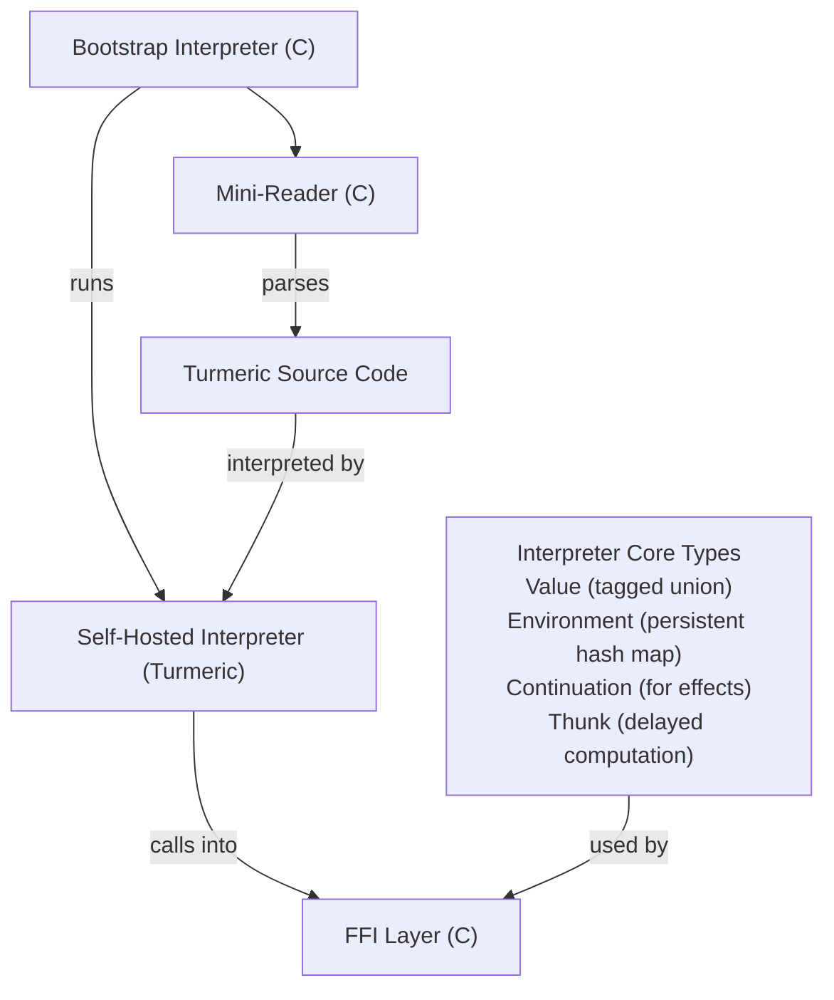

# Self-Hosted Turmeric Interpreter Plan

> **Status:** Speculative — Future Project  
> **Prerequisite:** Phase 19 complete (algebraic effects), stable Turmeric compiler  
> **Target:** v2 or later  
> **Related:** [turmeric-plan.md](turmeric-plan.md)

---

## Executive Summary

This document outlines the design and implementation of a **self-hosted Turmeric interpreter** — an interpreter for Turmeric largely written in Turmeric itself, bootstrapped on top of a minimal C interpreter. This project serves two purposes:

1. **Language dogfooding** — Demonstrate Turmeric's capability by implementing a significant system (an interpreter) in itself
2. **Comprehensive testing** — Exercise all of Turmeric's functionality: type system, effects, typeclasses, FFI, macros, pattern matching, etc.

The interpreter will be a **separate executable** (`turi`) distinct from the compiler (`tur`).

---

## Architecture Overview



### Components

| Component | Language | Purpose |
|---|---|---|
| Bootstrap Interpreter | C | Minimal interpreter to run self-hosted code |
| Mini-Reader | C | Parses Turmeric s-expressions for bootstrap |
| Self-Hosted Interpreter | Turmeric | Full interpreter implementation |
| FFI Layer | C | Bridges C and Turmeric for I/O, etc. |

---

## Design Goals

### Primary Goals
- **Self-hosting**: The interpreter reads, evaluates, and prints Turmeric code
- **Completeness**: Support full Turmeric language semantics
- **Correctness**: Faithfully implement Turmeric's operational semantics
- **Performance**: Reasonable performance for an interpreter (not a compiler)

### Secondary Goals
- **Debuggability**: Provide good error messages and introspection
- **REPL**: Interactive read-eval-print loop
- **Scripting**: Shebang support for Turmeric scripts
- **Testing**: Comprehensive test suite for Turmeric features

### Non-Goals
- **Compiler replacement**: This is an interpreter, not a compiler
- **Optimization**: No JIT, no aggressive optimization passes
- **Parallelism**: Single-threaded execution model

---

## Implementation Phases

### Phase S0: Project Setup & Bootstrap Foundation

**Goal:** Establish the build infrastructure and minimal bootstrap interpreter.

**Exit Criterion:** Can compile and run a trivial Turmeric program via bootstrap.

#### Bootstrap Interpreter (`src/bootstrap/`)

- [ ] `bootstrap/interp.c` — Core interpretation loop in C
- [ ] `bootstrap/interp.h` — Public interface
- [ ] `bootstrap/value.c` — Tagged union value representation
- [ ] `bootstrap/value.h` — Value type definitions
- [ ] `bootstrap/env.c` — Environment implementation (hash map)
- [ ] `bootstrap/env.h` — Environment interface
- [ ] `bootstrap/mini_reader.c` — Minimal s-expression reader
- [ ] `bootstrap/mini_reader.h` — Reader interface

#### Value Representation

```c
// Tagged union for Turmeric values
typedef enum {
    VAL_NIL,
    VAL_BOOL,
    VAL_INT,
    VAL_FLOAT,
    VAL_SYMBOL,
    VAL_STRING,
    VAL_PAIR,
    VAL_VECTOR,
    VAL_CLOSURE,
    VAL_PRIMITIVE,
    VAL_STRUCT,
    VAL_TYPECLASS_DICT,
} ValueTag;

typedef struct Value Value;
struct Value {
    ValueTag tag;
    union {
        bool as_bool;
        int64_t as_int;
        double as_float;
        char* as_string;
        struct { Value* car; Value* cdr; } as_pair;
        struct { Value* data; size_t len; size_t cap; } as_vector;
        struct { Value* (*fn)(Value*, Value*); char* name; } as_primitive;
        struct { Value* env; Value* params; Value* body; } as_closure;
        struct { char* name; Value* fields; } as_struct;
    } data;
};
```

#### Build System

- [ ] `CMakeLists.txt` for `turi` executable
- [ ] Separate from main `tur` compiler build
- [ ] Shared libraries where applicable (reader, gc)

#### Fixtures
- [ ] `fixtures/bootstrap/hello.tur` — Simple program that runs
- [ ] `fixtures/bootstrap/arithmetic.tur` — Basic math operations
- [ ] `fixtures/bootstrap/conditionals.tur` — If expressions

---

### Phase S1: Self-Hosted Core (Minimal Viable Interpreter)

**Goal:** Implement a minimal but functional interpreter in Turmeric that can run on the bootstrap.

**Exit Criterion:** Self-hosted interpreter can evaluate basic Turmeric expressions.

#### Core Types (`src/turi/core.tur`)

```scheme
;; Value type - mirrors C representation
(deftype Value
  (Nil)
  (Bool bool)
  (Int int64)
  (Float double)
  (Symbol cstr)
  (String cstr)
  (Pair Value Value)
  (Vector (ref (Vec Value)))
  (Closure Env Ast)
  (Primitive (cfn *))
  (Struct cstr (ref (HashMap cstr Value))))

;; Environment - persistent hash map
(deftype Env (ref (HashMap cstr Value)))

;; Interpreter result
(deftype Result
  (Ok Value)
  (Err cstr))
```

#### Core Functions

- [ ] `src/turi/reader.tur` — S-expression reader in Turmeric
- [ ] `src/turi/eval.tur` — Core evaluation loop
- [ ] `src/turi/env.tur` — Environment operations (lookup, extend)
- [ ] `src/turi/apply.tur` — Function application
- [ ] `src/turi/special.tur` — Special forms (defn, if, lambda, etc.)

#### Bootstrap Integration

- [ ] `src/turi/main.c` — Entry point that loads self-hosted code
- [ ] FFI bindings for bootstrap to call Turmeric interpreter
- [ ] Mechanism to pass control from C to Turmeric

#### Fixtures
- [ ] `fixtures/turi/basic.tur` — All special forms work
- [ ] `fixtures/turi/functions.tur` — Function definition and calls
- [ ] `fixtures/turi/recursion.tur` — Recursive functions

---

### Phase S2: Language Completeness

**Goal:** Support all Turmeric language features in the interpreter.

**Exit Criterion:** All Phase 1-19 language features work in the interpreter.

#### Type System
- [ ] `src/turi/types.tur` — Type representation at runtime
- [ ] Type checking mode (optional, for debugging)
- [ ] Type introspection functions

#### Data Structures
- [ ] `src/turi/struct.tur` — `defstruct` support
- [ ] `src/turi/pair.tur` — Pair operations
- [ ] `src/turi/vector.tur` — Vector operations
- [ ] `src/turi/hashmap.tur` — Hash map operations
- [ ] `src/turi/string.tur` — String operations

#### Control Flow
- [ ] `src/turi/pattern.tur` — Pattern matching
- [ ] `src/turi/loop.tur` — Loop constructs
- [ ] `src/turi/exception.tur` — Exception handling

#### Fixtures
- [ ] `fixtures/turi/structs.tur` — Struct definition and access
- [ ] `fixtures/turi/pattern-match.tur` — Pattern matching examples
- [ ] `fixtures/turi/loops.tur` — Various loop constructs

---

### Phase S3: Advanced Features

**Goal:** Implement Turmeric's advanced features in the interpreter.

**Exit Criterion:** Typeclasses, effects, and macros work in the interpreter.

#### Typeclasses
- [ ] `src/turi/typeclass.tur` — Typeclass dictionary support
- [ ] Instance resolution at runtime
- [ ] Constraint satisfaction checking
- [ ] Built-in typeclasses (Eq, Ord, Show, Num)

#### Effects & Continuations
- [ ] `src/turi/effect.tur` — Effect handling
- [ ] `src/turi/continuation.tur` — Delimited continuations
- [ ] Effect row tracking
- [ ] Handler composition

#### Macros
- [ ] `src/turi/macro.tur` — Macro expansion
- [ ] Macro environment
- [ ] Hygienic macro support

#### Fixtures
- [ ] `fixtures/turi/typeclass.tur` — Typeclass usage
- [ ] `fixtures/turi/effects.tur` — Effect examples
- [ ] `fixtures/turi/macros.tur` — Macro examples

---

### Phase S4: FFI and I/O

**Goal:** Connect the interpreter to the outside world.

**Exit Criterion:** Can perform I/O and call C functions from interpreted code.

#### FFI Layer
- [ ] `src/turi/ffi.tur` — FFI bindings in Turmeric
- [ ] C function calling
- [ ] C struct access
- [ ] Memory management for FFI

#### I/O Operations
- [ ] `src/turi/io.tur` — File I/O
- [ ] `src/turi/console.tur` — Console I/O
- [ ] `src/turi/process.tur` — Process operations

#### Standard Library
- [ ] `stdlib/turi/prelude.tur` — Prelude for interpreted code
- [ ] Port necessary stdlib functions to work in interpreter

#### Fixtures
- [ ] `fixtures/turi/io.tur` — File reading and writing
- [ ] `fixtures/turi/ffi.tur` — Calling C functions
- [ ] `fixtures/turi/system.tur` — System operations

---

### Phase S5: REPL and Tooling

**Goal:** Build a usable interactive environment and command-line tool.

**Exit Criterion:** Working REPL with history, completion, and scripting support.

#### REPL Implementation
- [ ] `src/turi/repl.tur` — REPL in Turmeric
- [ ] Readline integration (via FFI)
- [ ] History support
- [ ] Tab completion
- [ ] Pretty printing

#### Command-Line Interface
- [ ] `src/turi/main.c` — CLI argument parsing
- [ ] File execution: `turi file.tur`
- [ ] REPL mode: `turi` (no args)
- [ ] Script mode: shebang support
- [ ] Options: `-v` (verbose), `-d` (debug), `--type-check`

#### Debugging Tools
- [ ] `src/turi/debug.tur` — Debugging utilities
- [ ] Stack trace on error
- [ ] Value inspection
- [ ] Environment inspection

#### Fixtures
- [ ] Test REPL interaction
- [ ] Test file execution
- [ ] Test error reporting

---

### Phase S6: Testing and Validation

**Goal:** Comprehensive testing of Turmeric functionality through the interpreter.

**Exit Criterion:** All major Turmeric features validated via interpreter tests.

#### Test Suite Structure

```
fixtures/turi-test/
├── phase01-basic/
│   ├── arithmetic.tur
│   ├── booleans.tur
│   └── conditionals.tur
├── phase02-types/
│   ├── structs.tur
│   ├── enums.tur
│   └── type-aliases.tur
├── phase03-functions/
│   ├── closures.tur
│   ├── recursion.tur
│   └── higher-order.tur
├── phase04-control/
│   ├── pattern-matching.tur
│   ├── loops.tur
│   └── exceptions.tur
├── phase05-modules/
│   ├── import-export.tur
│   ├── namespaces.tur
│   └── circular.tur
├── phase06-macros/
│   ├── defmacro.tur
│   ├── hygiene.tur
│   └── syntax-rules.tur
├── phase07-ffi/
│   ├── c-calls.tur
│   ├── c-structs.tur
│   └── callbacks.tur
├── phase08-async/
│   ├── threads.tur
│   ├── futures.tur
│   └── async-await.tur
├── phase09-gc/
│   ├── rc.tur
│   ├── ref.tur
│   └── borrow.tur
├── phase10-advanced-gc/
│   ├── cycle-collection.tur
│   └── weak-refs.tur
├── phase11-owner/
│   ├── ownership.tur
│   └── borrowing.tur
├── phase12-lifetimes/
│   ├── explicit-lifetimes.tur
│   └── lifetime-elision.tur
├── phase13-defer/
│   ├── defer.tur
│   └── cleanup.tur
├── phase14-continuations/
│   ├── shift-reset.tur
│   └── continuations.tur
├── phase15-typeclasses/
│   ├── defclass.tur
│   ├── definstance.tur
│   └── constraints.tur
├── phase16-effects/
│   ├── defeffect.tur
│   ├── perform.tur
│   └── handle.tur
├── phase17-exceptions/
│   ├── try-catch.tur
│   └── throw.tur
├── phase18-continuations-v2/
│   └── delimited.tur
└── phase19-algebraic-effects/
    ├── effect-rows.tur
    └── handlers.tur
```

#### Test Runner
- [ ] `src/turi/test_runner.tur` — Automated test execution
- [ ] Test discovery
- [ ] Test reporting
- [ ] Failure analysis

#### Validation Tests
- [ ] `tests/validate_phases.tur` — Validate each phase's features
- [ ] `tests/validate_interop.tur` — Validate C interop
- [ ] `tests/validate_performance.tur` — Performance benchmarks

---

### Phase S7: Polish and Documentation

**Goal:** Final polish, documentation, and release preparation.

**Exit Criterion:** Interpreter is documented, tested, and ready for use.

#### Documentation
- [ ] `docs/turi.md` — User documentation
- [ ] `docs/turi-internals.md` — Internals documentation
- [ ] Examples and tutorials
- [ ] API reference

#### Performance
- [ ] Profiling and optimization
- [ ] Memory usage analysis
- [ ] Startup time optimization

#### Integration
- [ ] Integration with `tur` compiler (optional)
- [ ] Cross-compilation support
- [ ] Packaging for distribution

---

## Testing Strategy

### Unit Tests
Each module in `src/turi/` has corresponding unit tests in `tests/turi/`.

### Integration Tests
Tests that exercise multiple features together.

### Validation Tests
Tests that validate Turmeric's functionality by running programs that use specific features.

### Comparison Tests
Compare interpreter output with compiler output for the same programs.

### Fuzzing
Random program generation to find edge cases.

---

## Build and Dependency Structure

```
Root (fith/)
├── src/
│   ├── bootstrap/           # Bootstrap interpreter (C)
│   │   ├── interp.c
│   │   ├── interp.h
│   │   ├── value.c
│   │   ├── value.h
│   │   ├── env.c
│   │   ├── env.h
│   │   ├── mini_reader.c
│   │   └── mini_reader.h
│   └── turi/                # Self-hosted interpreter (Turmeric)
│       ├── main.c          # Entry point
│       ├── core.tur
│       ├── reader.tur
│       ├── eval.tur
│       ├── env.tur
│       ├── apply.tur
│       ├── special.tur
│       ├── types.tur
│       ├── struct.tur
│       ├── pair.tur
│       ├── vector.tur
│       ├── string.tur
│       ├── pattern.tur
│       ├── loop.tur
│       ├── exception.tur
│       ├── typeclass.tur
│       ├── effect.tur
│       ├── continuation.tur
│       ├── macro.tur
│       ├── ffi.tur
│       ├── io.tur
│       ├── console.tur
│       ├── repl.tur
│       ├── debug.tur
│       └── test_runner.tur
├── fixtures/
│   ├── bootstrap/          # Bootstrap test fixtures
│   └── turi/               # Self-hosted test fixtures
│       └── turi-test/      # Comprehensive feature tests
├── tests/
│   ├── turi/               # Unit tests
│   └── validate/           # Validation tests
└── CMakeLists.txt           # Build configuration
```

---

## Key Design Decisions

### Decision 1: Interpretation Strategy

**Options:**
- (a) Direct interpretation (AST walking)
- (b) Bytecode interpretation
- (c) CPS-based interpretation

**Decision:** (a) Direct interpretation with (c) CPS for effects

**Rationale:** Direct interpretation is simplest and most natural for a Lisp. CPS transformation handles effects naturally.

### Decision 2: Value Representation

**Options:**
- (a) Tagged union (nan-boxing for numbers)
- (b) Separate allocations for each type
- (c) Two-word representation (tag + pointer)

**Decision:** (a) Tagged union with nan-boxing

**Rationale:** Memory efficient, good cache locality, and natural for a dynamic interpreter.

### Decision 3: Environment Representation

**Options:**
- (a) Linked list of frames
- (b) Hash map
- (c) Persistent hash map

**Decision:** (c) Persistent hash map

**Rationale:** Enables efficient shadowing and copying, matches functional semantics.

### Decision 4: FFI Strategy

**Options:**
- (a) Direct C calls via function pointers
- (b) Wrapper functions in C
- (c) libffi-based approach

**Decision:** (a) Direct C calls with (b) wrappers for complex cases

**Rationale:** Direct calls are fastest; wrappers handle marshalling.

### Decision 5: REPL Architecture

**Options:**
- (a) Pure Turmeric REPL
- (b) C-based REPL with Turmeric evaluation
- (c) Hybrid approach

**Decision:** (b) C-based REPL

**Rationale:** Better integration with readline, easier signal handling.

---

## Performance Considerations

| Operation | Target Performance |
|---|---|
| Function call | < 100ns |
| Variable lookup | < 50ns |
| Arithmetic operation | < 20ns |
| FFI call | < 500ns |
| Pattern match | < 1us per alternative |
| Typeclass resolution | < 1us |

---

## Risk Assessment

| Risk | Probability | Impact | Mitigation |
|---|---|---|---|
| Bootstrap interpreter too slow | Medium | High | Optimize critical paths, profile early |
| Self-hosted code too large for bootstrap | Low | High | Keep bootstrap minimal, test incrementally |
| Memory management issues | High | High | Use existing Turmeric GC, careful testing |
| FFI complexity | Medium | Medium | Start with simple cases, build up |
| Performance insufficient | Medium | Medium | Profile, optimize hot paths |
| Feature gaps in Turmeric | Medium | High | Work with compiler team, use workarounds |

---

## Success Criteria

### Minimum Viable (Phase S1 Complete)
- [ ] Can evaluate basic Turmeric expressions
- [ ] REPL works for simple interactions
- [ ] Can run small Turmeric programs

### Feature Complete (Phase S4 Complete)
- [ ] All Phase 1-19 features work
- [ ] I/O operations work
- [ ] FFI works
- [ ] Can run stdlib code

### Production Ready (Phase S7 Complete)
- [ ] Comprehensive test suite passes
- [ ] Performance meets targets
- [ ] Documentation complete
- [ ] Packaged for distribution

---

## Timeline Estimate

| Phase | Estimated Duration |
|---|---|
| S0: Project Setup & Bootstrap | 2-4 weeks |
| S1: Self-Hosted Core | 4-6 weeks |
| S2: Language Completeness | 6-8 weeks |
| S3: Advanced Features | 6-8 weeks |
| S4: FFI and I/O | 4-6 weeks |
| S5: REPL and Tooling | 4-6 weeks |
| S6: Testing and Validation | 4-6 weeks |
| S7: Polish and Documentation | 2-4 weeks |
| **Total** | **32-48 weeks** |

---

## Resources Required

- 1-2 core developers
- Access to Turmeric compiler team for questions
- CI infrastructure for testing
- Documentation infrastructure

---

## Related Documents

- [turmeric-plan.md](turmeric-plan.md) — Main compiler roadmap
- [effects-plan.md](archive/effects-plan.md) — Effect system design
- [typeclass-plan.md](typeclass-plan.md) — Typeclass design
- [module-system-plan.md](module-system-plan.md) — Module system design

---

## Appendix A: Example Programs

### Example 1: Factorial

```scheme
(defn factorial [n : int] : int
  (if (<= n 1)
      1
      (* n (factorial (- n 1)))))

(factorial 10)  ; => 3628800
```

### Example 2: REPL Session

```
$ turi
Turmeric Interpreter v0.1.0
turmeric> (defn square [x] (* x x))
#<function square>
turmeric> (square 5)
25
turmeric> (defstruct Point [x y])
#<type Point>
turmeric> (defn distance [p1 p2] (sqrt (+ (square (- p1.x p2.x)) (square (- p1.y p2.y)))))
#<function distance>
turmeric> (distance (Point 0 0) (Point 3 4))
5.0
```

### Example 3: Typeclass Usage

```scheme
(defclass Show [a]
  (show [x : a] : cstr))

(definstance Show int
  (show [x] (int->cstr x)))

(defn print-show [^Show a x : a]
  (printf "%s\n" (show x)))

(print-show 42)  ; prints "42"
```

### Example 4: Effect Usage

```scheme
(defeffect Console
  (print [s : cstr]))

(defn greet [name]
  (perform (Console.print) "Hello, ")
  (perform (Console.print) name)
  (perform (Console.print) "!\n"))

(handle
  (greet "World")
  (Console => [print]
    (fn [s] (printf "%s" s))))
; prints "Hello, World!"
```

---

## Appendix B: Bootstrap Process

The bootstrap process works as follows:

1. **C Bootstrap Interpreter** compiles to native code via standard C compiler
2. **Self-Hosted Interpreter** is written in Turmeric and compiled to C by the main `tur` compiler
3. **Bootstrap** loads the compiled self-hosted interpreter as a library
4. **Control Transfer** happens from C to Turmeric
5. **Interpretation** proceeds in Turmeric code

This is a **two-stage bootstrap**: C interpreter → Self-hosted interpreter.

---

## Appendix C: Comparison with Other Approaches

| Approach | Pros | Cons |
|---|---|---|
| Pure C Interpreter | Fast startup, no compiler dependency | Harder to maintain, less dogfooding |
| Full Self-Hosting (no C) | Maximum dogfooding | Chicken-and-egg problem |
| Bytecode VM | Fast execution, portable | Complex, another IR |
| **Our Approach** | Good dogfooding, manageable complexity | Two-stage bootstrap |

---

*Last updated: 2026-05-10*
