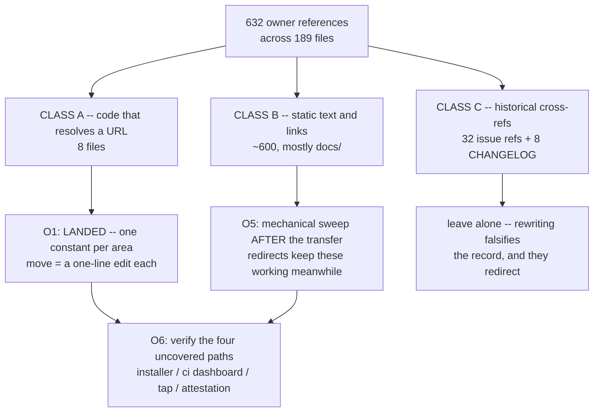

# Moving the Turmeric repos to a GitHub org

> **Status: PROPOSED 2026-10-01. Step O1 (reference consolidation) has landed;
> the transfer itself has not.** Written in answer to "what is a good option for
> moving turmeric repos out of my rjungemann account -- a free-tier GH org?"
> The short answer is **yes, GitHub Free for organizations is sufficient and
> costs nothing here**, and section 1 is the measurement that settles it.
> **Type:** repository / release infrastructure
> **Touches:** no compiler source. `tvm/tvm.sh`, `web/{repo,site,ci-metrics,worker}.js`,
> `tools/gen{guides,spices}.py`, [`.github/workflows/ci.yml`](../../.github/workflows/ci.yml),
> `Formula/turmeric.rb`, `scripts/wait-for-release.sh`, `cmake/mir.cmake`,
> `.claude/commands/cut-*-release.md`, and ~600 link occurrences under `docs/`.
>
> **Decided before writing any of this down:**
> 1. **A free org is enough, because every repo is public.** Standard-runner
>    Actions minutes are unlimited on public repos. The 2,000-minute Free
>    allowance only bills private repos -- where the 10x macOS multiplier would
>    make this repo's CI unaffordable within a week (section 1).
> 2. **Target name `turmeric-lang`**, matching the domain. Plain `turmeric` is
>    a taken user account. `turmeric-lang` was unclaimed on 2026-10-01 and is
>    being reserved.
> 3. **`turmeric` and `turmeric-spices` must move in the same window**, spices
>    first. O1 made the CI clone owner-relative, which is what creates the
>    ordering constraint (section 4.1). This is the one way the move can turn
>    CI red on its own.
> 4. **Do not rewrite `owner/repo#N` cross-references or CHANGELOG entries.**
>    They redirect, and rewriting them falsifies a historical record
>    (section 3, Class C).

## 0. Summary

Nothing about the move is hard. What makes it worth a plan is that the
breakage is **concentrated in a handful of places that no test covers**: the
installer served at `turmeric-lang.com/install`, the `/ci` dashboard's data
source, the Homebrew tap name, and release-asset attestation verification.
None of those are exercised by `bash tests/run.sh` or by CI, so a move that
"looks green" can still have broken the install path for every new user.

The compiler is not at risk at all: `git grep rjungemann -- src/ stdlib/`
returns **nothing**. The move can break distribution and documentation; it
cannot break the product.



## 1. Why GitHub Free for organizations is sufficient

Every repo in the family is **public**:

| Repo | Visibility | Owner refs in this tree |
| --- | --- | --- |
| `turmeric` | public | 405 (+4 as `.git`) |
| `turmeric-spices` | public | 134 |
| `mir` (fork of `vnmakarov/mir`) | public | 39 (+2 as `.git`) |
| `trowel` | public | 24 |
| `smt-lib-benchmarks` | public | 11 |
| `turmeric-godot` | public | 7 |
| `asdf-turmeric` | public | 3 (+2 as `.git`) |

GitHub Actions on standard runners is **free and unmetered for public
repositories**. The Free plan's 2,000 minutes/month applies only to private
repos, and there it is billed against multipliers -- macOS 10x, Windows 2x.

That multiplier is why visibility, not plan tier, is the real decision. From
[ci-aux-suite-latency-plan](https://github.com/rjungemann/turmeric/blob/main/docs/upcoming/ci-aux-suite-latency-plan.md),
the `Auxiliary suites (macos-latest)` job alone runs **56-66 minutes**. Were
these repos private on a Free org:

- One aux job = 56 min x 10 = **560 billed minutes**.
- The 2,000-minute allowance = **three and a half PRs per month**, before
  counting the Linux legs, Windows, the JIT matrix, or `fuzz.yml`.

So: **keep the repos public.** If any of them ever needs to go private, the
plan tier stops being a formality and the macOS legs have to be rethought
first. Team ($4/user/month) raises the allowance to 3,000 minutes, which does
not change that conclusion -- it buys 5 PRs instead of 3.5.

What Free for orgs does *not* include is irrelevant to a public-repo project:
protected branches and rulesets, required reviewers, and CODEOWNERS are all
available on public repos at the Free tier. Private Pages and SAML SSO are
the real Team/Enterprise features, and neither is in use.

## 2. What the transfer carries, and what it silently drops

GitHub moves more than people expect, which is what makes the exceptions
dangerous -- the move looks complete.

**Carried automatically:** git history and tags, releases *and their assets*,
issues and pull requests with their numbers intact, stars, watchers, wiki,
Git LFS objects, and a permanent redirect from every old URL. `git clone`,
`git fetch`, the web UI, and `api.github.com` all follow that redirect, so
existing clones and already-installed `tvm` keep working.

> The redirect survives only while nothing occupies the old path. **Never
> create a repo named `turmeric` under `rjungemann` again** -- doing so
> silently breaks every old link, every existing clone's remote, and the
> installer for anyone who cached an old URL.

**Dropped or reset, in rough order of how expensive it is to notice:**

| Thing | Consequence | Where it bites |
| --- | --- | --- |
| **Actions secrets** | `SENTRY_DSN` becomes empty | `fuzz.yml:144,273`, `tsan.yml:86` -- runs stay green while reporting nothing |
| **Rulesets / branch protection** | base-branch gate may lapse | CI is `pull_request: branches: [main]`; see section 6.1 |
| **Dependabot alerts + security updates** | silently off | the tree has active Dependabot PRs today |
| **CodeQL default setup** | `codeql.yml` may need re-enabling | security tab goes quiet |
| **Allowed-actions policy** | third-party actions blocked | `mymindstorm/setup-emsdk`, and every pinned action in `ci.yml` |
| **Fine-grained PATs scoped to `rjungemann/*`** | 404s, not auth errors | any local tooling, `gh` config, release scripts |
| **Deploy keys / Git integrations** | web deploy stops | Cloudflare/Vercel connection is per-account |

Set `SENTRY_DSN` as an **org-level** secret rather than three repo-level
copies. That is strictly better than today's arrangement and is the one place
where the move improves the status quo for free.

## 3. The three classes of reference

632 occurrences, 189 files. They are not one problem:

### Class A -- code that resolves a URL (8 files) -- **DONE in O1**

These actually fetch something, so a stale owner is a runtime failure, not a
dead link. Each now has exactly one literal, so the move is a one-line edit:

| File | Single source of truth | Notes |
| --- | --- | --- |
| `web/repo.js` | `GH_REPO` (**new**) | mirrors the `csp.js` "one source, several appliers" pattern |
| `web/site.js` | imports `GITHUB_URL` | 3 literals -> 0 |
| `web/ci-metrics.js` | imports `GITHUB_URL` | commit permalinks |
| `web/worker.js` | imports `GH_REPO` | installer `REPO=` **and** the ci-metrics raw base |
| `tvm/tvm.sh` | `__tvm_gh_repo()` | the 3 `TVM_*` overrides still win |
| `tools/genguides.py` | `GITHUB_URL` | verified output-identical, 147 files |
| `tools/genspices.py` | `GITHUB_BASE` | already one constant; now says so |
| `.github/workflows/ci.yml` | `${{ github.repository_owner }}` | needs **no** edit at move time |
| `scripts/wait-for-release.sh` | `TURMERIC_REPO` default | already overridable before O1 |
| `Formula/turmeric.rb` | `head` URL | one literal; a formula cannot import a constant |
| `cmake/mir.cmake` | `TUR_MIR_GIT_REPOSITORY` | already a CACHE var; see 4.2 |

### Class B -- static text and links (~600, overwhelmingly `docs/`)

| Area | Files | Occurrences |
| --- | --- | --- |
| `docs/archive/` | 96 | (585 total under `docs/`) |
| `docs/guides/` | 83 | |
| `docs/reported/` | 6 | |
| `docs/upcoming/` | 4 | |
| `web/*.html`, `README.md`, `SECURITY.md`, `tvm/README.md`, `emacs/`, `vscode-syntax-ext/`, `benchmarks/`, `tests/corpus/smtlib/` | ~14 | ~25 |

These redirect, so none of them is urgent. They are a single mechanical
commit **after** the transfer (O5). Guides carry absolute GitHub URLs by
convention -- only `docs/guides/` and `docs/api/` are published, so a relative
link to `reported/`, `archive/` or `upcoming/` would 404 on the site -- which
is why this count is large and will stay large.

The sweep rule, stated so it can be applied without judgement calls:

> Rewrite `https://github.com/rjungemann/<repo>` -> `https://github.com/turmeric-lang/<repo>`
> for the repos that actually moved. Leave everything else.

### Class C -- historical cross-references (40) -- **leave alone**

- **32** `owner/repo#N` shorthand issue/PR references (`rjungemann/turmeric#1002`
  in `CMakeLists.txt:1364`, `rjungemann/mir#4` and `#5` in `cmake/mir.cmake`,
  `rjungemann/turmeric#846` in `tests/run-refine-wasm.sh:52`, a fixture
  comment, and 20-odd in `docs/archive/`).
- **8** CHANGELOG entries.
- Prose describing past behavior, e.g. `web/worker.js:5` recording that the
  installer "used to be `brew install --HEAD rjungemann/turmeric/turmeric`".

All of these redirect. Rewriting them would assert that a thing which
happened under one owner happened under another, which is exactly the kind of
archeology-by-sed that a later reader cannot untangle. A blind
`s/rjungemann/turmeric-lang/g` over the tree would hit all 40.

## 4. Scope -- which repos move

### 4.1 `turmeric` + `turmeric-spices` move together, spices first

This is a hard ordering constraint and it is one that O1 introduced
deliberately. `ci.yml` now clones:

```sh
"$GIT" clone --depth 1 \
  "https://github.com/${{ github.repository_owner }}/turmeric-spices" \
  ../turmeric-spices
```

Owner-relative, which makes the step's trust-boundary comment true by
construction instead of by convention -- the clone can no longer reach outside
the owner that owns the workflow. The cost is that **the two repos must share
an owner at all times**:

| Order | Result |
| --- | --- |
| spices first | turmeric's CI keeps cloning `rjungemann/turmeric-spices` via redirect, then resolves to the org. **Safe.** |
| turmeric first | CI immediately clones `turmeric-lang/turmeric-spices`, which does not exist yet. **Every PR red** until spices follows. |
| both, same sitting | Safe, and the window where it matters is minutes. |

Also note that `turmeric-spices` CI re-pins turmeric's `main` on every
run, so two spices runs hours apart already use different compilers -- and
the spices side has its own owner references to sweep in the same window.

### 4.2 Decisions still open

| Repo | Recommendation | Why it is not obvious |
| --- | --- | --- |
| `smt-lib-benchmarks` | move | referenced only from `tests/corpus/` docs; purely cosmetic either way |
| `turmeric-godot` | move | ecosystem repo, 7 refs |
| `asdf-turmeric` | move | an asdf plugin URL is user-visible and is pasted into user shells; moving it means users' existing `asdf plugin add` lines rely on the redirect |
| `trowel` | **ask** | a distinct product with its own site section and its own Homebrew cask (`rjungemann/trowel/trowel`); it is "a Turmeric repo" only by association |
| `mir` | **probably leave** | it is a *fork of `vnmakarov/mir`* carrying 2 merged patches, consumed as a build pin. `cmake/mir.cmake:127` already says to point `TUR_MIR_GIT_REPOSITORY` back at upstream once the patches land there. Moving a temporary fork into the org implies more permanence than it has |

### 4.3 The Homebrew tap renames itself

There is no `rjungemann/homebrew-turmeric` -- it 404s. The tap *is* this repo:
`Formula/turmeric.rb` lives at the root. So `brew install --HEAD
rjungemann/turmeric/turmeric` resolves against the repo directly, and after
the move the documented command becomes:

```sh
brew install --HEAD turmeric-lang/turmeric/turmeric
```

Three places say the old form: `README.md:41`, `web/index.html:333`, and
`web/worker.js:111` (which O1 changed to derive from the installer's own
`REPO`, so it now follows `GH_REPO` for free). Users with the tap already
cloned should `brew untap rjungemann/turmeric` before tapping the new name;
brew keys its tap cache by name and will otherwise keep the stale one.

## 5. Runbook

### O1 -- consolidate the references (**LANDED**)

One constant per area, defaulting to today's owner so the change is a no-op.
Verified: `tvm` URL derivation byte-identical with overrides still winning;
all four web modules parse as ESM with identical interpolated values;
`genguides.py` output byte-identical across 147 files; `ci.yml` valid YAML.

### O2 -- verify what redirects, before committing to the move

The highest-risk unknown, and it is cheap to settle. **`raw.githubusercontent.com`
is widely reported not to follow repo-transfer redirects.** Two things depend
on it:

- `web/worker.js` `TIMINGS_BASE` -- the entire `/ci` dashboard's data source.
- the installer's `RAW` -- how `tvm.sh` itself is fetched during bootstrap.

If raw does not redirect, both break **the instant the transfer completes**,
and the fix (O4) has to be deployed in the same window rather than at leisure.

Settle it empirically on a throwaway repo rather than on the real one:

```sh
gh repo create rjungemann/redirect-probe --public --add-readme
# transfer it to the org, then:
curl -sSo /dev/null -w '%{http_code} -> %{redirect_url}\n' \
  https://raw.githubusercontent.com/rjungemann/redirect-probe/main/README.md
curl -sSo /dev/null -w '%{http_code}\n' \
  https://api.github.com/repos/rjungemann/redirect-probe
gh repo delete rjungemann/redirect-probe --yes   # or the org path
```

Record the answer in this section. Also worth probing on the same repo:
`codespaces.new/<owner>/<repo>`, and a release asset's `browser_download_url`.

### O3 -- create the org and pre-stage settings

1. Create `turmeric-lang` (Free). Add the personal account as owner.
2. **Before** transferring: set `SENTRY_DSN` as an org secret; set the
   allowed-actions policy to permit the actions `ci.yml` pins; enable
   Dependabot alerts and security updates org-wide.
3. Re-scope any fine-grained PAT from `rjungemann/*` to the org.

### O4 -- transfer, spices first

Per 4.1. For each repo: Settings -> Transfer ownership, or

```sh
gh api -X POST repos/rjungemann/<repo>/transfer -f new_owner=turmeric-lang
```

Then immediately, in one commit on a branch:

- `web/repo.js`: `GH_REPO = 'turmeric-lang/turmeric'` (covers 4 web files)
- `tvm/tvm.sh`: the `__tvm_gh_repo` default
- `tools/genguides.py`: `GITHUB_URL`
- `tools/genspices.py`: `GITHUB_BASE`
- `scripts/wait-for-release.sh`: the `TURMERIC_REPO` default
- `Formula/turmeric.rb`: the `head` URL
- `.claude/commands/cut-*-release.md`: the `gh attestation verify --repo` owner
  (3 files) -- **but read 6.2 first**
- `.github/workflows/ci.yml`: **nothing**

Re-apply branch protection / rulesets, confirm CI is still gated on `main`,
and reconnect the web deploy integration.

### O5 -- sweep Class B

One commit, after the transfer, applying the 3.2 rule. Not a blind
`sed`: 40 Class C references would be caught by one. BSD `sed -i` also has no
`\b`, so use `perl -pi -e` with an explicit URL-shaped pattern:

```sh
git grep -Il 'github\.com/rjungemann/' \
  | grep -v CHANGELOG.md \
  | xargs perl -pi -e 's{github\.com/rjungemann/(turmeric|turmeric-spices)\b}{github.com/turmeric-lang/$1}g'
```

Then `git diff --stat`, and read the diff before committing -- the pattern is
URL-anchored precisely so that `rjungemann/turmeric#1002` cannot match.
Regenerate the docs (`tur run docs`) and confirm the rendered output moves
only where expected.

### O6 -- verify the four paths no test covers

CI going green proves almost nothing here. Check by hand:

1. **Installer:** `curl -fsSL https://turmeric-lang.com/install | sh` in a
   container, end to end, including the checksum step.
2. **`/ci` dashboard:** load it and confirm the NDJSON actually arrives
   (this is the O2 raw-redirect question, now live).
3. **Homebrew:** `brew untap rjungemann/turmeric` then
   `brew install --HEAD turmeric-lang/turmeric/turmeric`.
4. **Attestation:** `gh attestation verify <asset> --repo turmeric-lang/turmeric`
   on a release cut *after* the move -- and see 6.2.

## 6. Two traps worth naming

### 6.1 CI's base-branch gate is a ruleset-adjacent assumption

`ci.yml` is gated `pull_request: branches: [main]`, which is load-bearing for
a reason unrelated to this move (it keeps the workflow off the `ci-metrics`
orphan branch that `tools/ci/publish-timings.sh` pushes to). After the
transfer, confirm the first PR actually produces checks. A PR with no checks
reports "no checks reported on the branch" rather than anything that looks
like a failure, so it is easy to read as green.

### 6.2 Old releases' attestations name the old owner forever

Build provenance binds each asset to the repo via the release job's OIDC
token. Assets built before the move are signed as `rjungemann/turmeric`; that
is a cryptographic fact and no redirect changes it. So:

- `gh attestation verify <old-asset> --repo turmeric-lang/turmeric` **fails**,
  correctly.
- Verifying a pre-move release requires `--repo rjungemann/turmeric`.

The three `cut-*-release.md` files should therefore not simply have the owner
swapped -- they should say which owner applies to which vintage, so that a
user verifying v0.x after the move is not told their download is compromised.
This is the one item in O4 that needs prose, not a string replacement.

## 7. What this plan does not do

- It does not rename anything. Repo names are unchanged; only the owner moves.
- It does not touch the compiler. `src/` and `stdlib/` carry zero references.
- It does not propose a CI guard against new hardcoded owners. Worth
  considering once the move is done -- a check that the Class A files contain
  no literal owner would keep the one-line property true -- but adding a job
  to the auxiliary suites runs against
  [ci-aux-suite-latency-plan](https://github.com/rjungemann/turmeric/blob/main/docs/upcoming/ci-aux-suite-latency-plan.md),
  which is actively trying to make that job smaller.
