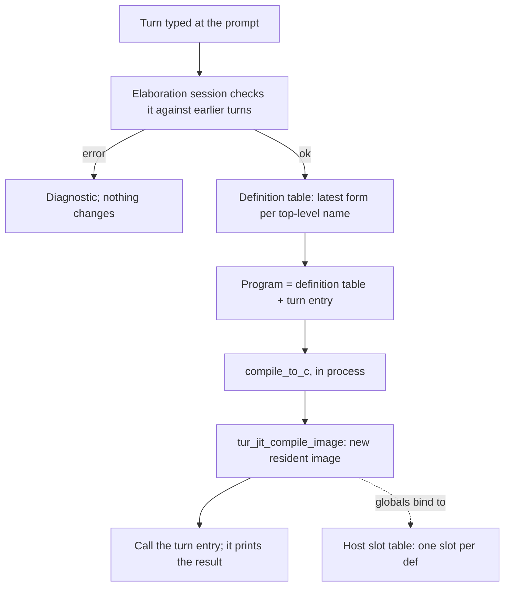

# Plan: Compiled evaluation at the `tur repl` prompt

> **Status:** Proposed, on hold, not started. **Rewritten 2026-09-29.** The
> 2026-06-28 draft (in git history) proposed compiling each prompt form with a
> `cc` subprocess into a `.so` and `dlopen`ing it. It predates the in-process
> MIR JIT (graduated 0.34.0). The JIT and the spice REPL now provide most of
> the machinery the draft planned to build, and the draft had design flaws
> this version fixes (see "Why not the 2026-06-28 draft"). The file name is
> historical: nothing here is ahead-of-time compiled any more. Move the plan to
> `docs/upcoming/` when work starts, and point the experiment rows'
> `plan_path` at it there.
> **Last Updated:** 2026-09-30
> **Track:** post-v1. C0, a bug fix, landed 2026-09-30.
> **Type:** REPL / interpreter (`src/turi/`) / JIT (`src/jit_engine.c`) /
> emitter (REPL-mode globals).
> **Requires:** `-DTUR_JIT=ON`. It is OFF by default and the release workflow
> does not turn it on, so C1-C3 reach source builds only until that changes
> (Open question 1).
> **See also:** [jit-guide](../../guides/jit-guide.md),
> [spice-repl-plan](../../archive/spice-repl-plan.md),
> [jit-engine-plan](../../archive/jit-engine-plan.md) (J2 image mode),
> [jit-ffi-c2mir-plan](../../archive/jit-ffi-c2mir-plan.md),
> [cc-path-preamble-split-plan](../cc-path-preamble-split-plan.md).

## Goal

Let a user type any Turmeric at `tur repl` and have it run the way `tur build`
would run it: inline-C, native layout, compiled semantics. The REPL must keep
its workflow while doing so: state carries from turn to turn, and anything can
be redefined.

The gap is concrete today. The interpreter runs an inline-C body only if it
recognises the pattern (`try_exec_simple_inline_c`, `src/turi/eval.c:5899`),
and refuses the rest. Piped into `tur repl` on `main` (`c6ba4162`):

````text
(defn seven [] : int
  ```c
  return 7;
  ```)
(seven)
(defn c-mix [a : int b : int] : int
  ```c
  int64_t t = a;
  return t * 31 + b;
  ```)
(c-mix 3 4)
````

```text
=> #<fn seven>
=> 7
=> #<fn c-mix>
error: eval: inline-C not supported in interpreter mode (function uses a native C implementation; run it with `tur build`/`tur run` instead of `--interpret`)
```

The same `c-mix` in a file prints `97` under `tur jit`. Until C0 landed, adding
a `for` loop to the body made things worse: the REPL could not even read the
form.

## What already exists

| Piece | Where | What this plan uses it for |
| --- | --- | --- |
| Incremental elaboration session (TR2.2b) | `TuriEnv.elab_session`, `src/turi/env.h:261`; on by default (`incremental_elab`, `:230`) | Checks each turn against earlier turns without re-elaborating them. Applies the REPL's redefinition rules (`elab_prior_turn_global`, `src/compiler/elab_core.c:2505`) and gives the turn's result type |
| JIT image mode (J2) | `tur_jit_compile_image` / `tur_jit_image_sym` / `tur_jit_image_free`, `src/jit_engine.h:74-103` | Compiles emitted C in process, links it against `tur`, runs `__tur_static_init`, and finds functions by C name, static ones included |
| Split runtime | `jit_try_split_preamble`, `src/main.c:4494` | Every image links against the one runtime inside `tur` instead of carrying its own copy of the preamble's state |
| Repeated in-process compile | `repl_jit_build`, `src/main.c:5155`; `compile_to_c` at `:5234` | Precedent for running the front end and emitter inside the REPL process on every `(reload)`, saving and restoring `g_interpret_mode` / `g_emit_for_link` around it |
| Old images stay resident | retired list, `src/turi/ffi_thunk.c:494-507` | The lifetime rule: never free an image something may still point into |
| Exports manifest and scalar marshaling | `g_manifest_sink` (`src/main.c:5232`), `tur_ffi_install_spice_bindings`, `src/turi/ffi_thunk.c` | Binding a compiled function as an interpreter native: C name, signature, and int/float/cstr/bool/nil marshaling |

## Why not the 2026-06-28 draft

- **Latency.** It assumed under 60ms per form from `clang -O0` on a ~50-line
  file. The emitted C for a one-line program is 9,545 lines, and `cc -O0 -g0
  -c` on that alone takes ~525ms (gcc 13) or ~150-290ms (clang 18). The draft
  also recompiled the whole growing session on every form.
- **`tur build --shared` refuses a single file** ("requires a directory
  argument (single-file builds emit static symbols)"). The symbol S2 would
  have `dlsym`'d does not exist.
- **Unloading the previous library is unsafe.** Closures, function pointers,
  string literals and instance dictionaries that point into it outlive it,
  and the OS does not track heap pointers. The spice reload already learned
  this and keeps old images.
- **Every `.so` carried its own runtime state** (allocator, regions, interned
  symbols, thread-locals). A value made by one generation would be consumed
  by another generation's runtime.
- **An append-only session cannot redefine.** A second `(def x ...)` or
  `(defn f ...)` in one file is an "already defined" error. (Until
  2026-09-30 the `defn` case got past the front end and failed in the C
  compiler instead:
  [duplicate-defn-in-one-file-reaches-the-c-compiler](../../archive/duplicate-defn-in-one-file-reaches-the-c-compiler.md).)
  The draft's registry also looked a `def` up *before* initializing it, so a
  re-`def` would have kept the stale value. The interpreter re-initializes.
- **A `void *` registry** cannot hold floats or by-value aggregates. Storing
  into it is also an escape store, which CLAUDE.md's "Region Store Hooks"
  rule requires to be noted.
- Smaller:
  - `TUR_M7_HKT=0` has been retired.
  - `(module ...)` and `instance` are really `defmodule` and `definstance`.
  - There is no `TUR_DEBUG` variable.
  - `src/runtime/globals.c` holds CLI configuration, not runtime code.
  - The value converters in `ffi_thunk.c` handle scalars only.
  - The inline-C example used a syntax that does not exist.

What survives from the draft: the goal, a host-owned table that keeps `def`
state across compiles (fixed below), and `:reset` as the clean slate.

## Measurements (2026-09-29)

Release `-DTUR_JIT=ON`, x86-64 Linux, 4 cores, `main` at `c6ba4162`.
Timings are best of 3, end to end. `compile_ms` comes from `tur jit
--timing-json` and covers c2mir plus link, on the split runtime.

| Program | Emitted C | `tur emit-c` | `tur jit` compile_ms | `tur jit` wall |
| --- | --- | --- | --- | --- |
| one `defn` + `main` | 9,545 lines | ~23ms | ~110ms | ~135ms |
| 200 small `defn`s | 11,762 lines | ~37ms | ~115-125ms | ~140-160ms |
| 800 small `defn`s | 18,362 lines | ~100ms | ~170-180ms | ~195-210ms |

For comparison, `tur build` of the one-line program takes ~210ms.

In process, a compiled turn pays roughly the `emit-c` column plus the
`compile_ms` column. That is ~130ms for a small session, growing slowly with
the number of definitions. C2 is designed around that budget, and C4 lists
the ways to reduce it.

## Design

### C0 -- the prompt must accept a multi-line inline-C form (LANDED 2026-09-30)

This was a bug fix:
[repl-continuation-counter-misreads-reader-syntax](../../archive/repl-continuation-counter-misreads-reader-syntax.md).
A `for (...;...;...)` inside a fence kept the `..` prompt open forever, and a
`')'` char literal made the REPL evaluate the form halfway through the fence.
The REPL now asks `reader_open_depth` (`src/compiler/reader.c`) whether the
input is complete, and keeps a blank line typed inside a fence or string.
C1 and C2 could not be tested at an interactive prompt without it.

### C1 -- JIT the inline-C `defn`s the interpreter cannot run

The smallest change that closes the gap. The interpreter stays the evaluator,
and only the inline-C bodies it refuses get compiled.

- **Trigger.** Compile on the first call where `try_exec_simple_inline_c`
  declines and the interpreter would otherwise return "inline-C not
  supported" (`src/turi/eval.c:11569`). This applies only on a JIT build with
  the experiment on. Compiling lazily means the stdlib's inline-C, which has
  native overrides, is never compiled, and a `defn` that is never called costs
  nothing. Cache the compiled function on the binding, and drop the cache when
  the name is redefined.
- **Compile.**
  - Build a minimal program: the `defn`'s own source form, plus the
    session's `defstruct`/`defopaque`/`defdata` forms that its signature
    names.
  - Run it through `compile_to_c` in process, with the same flag
    save/restore that `repl_jit_build` does. Set `g_manifest_sink` so the
    emitter reports the function's C name and signature.
  - JIT the result with `tur_jit_compile_image` and look the function up
    with `tur_jit_image_sym`.

  Going through the real emitter keeps everything the interpreter cannot
  reproduce: hoisted `#include`s, the preamble's typed builders
  (`tur_ok_ptr`, ...), and the body-entry region note for typed node
  parameters.
- **Bind.** Install the function as an interpreter native through the same
  marshaling that spice exports use. Coverage is whatever that path supports
  today: int-class, float, cstr, bool, nil. Other signatures keep today's
  error, extended to name the unsupported type.
- **Refuse cleanly** when the body calls another Turmeric definition (the
  minimal program then does not elaborate) or c2mir rejects the C. Print
  c2mir's diagnostic, then today's error.
- **Cost.** One ~110ms compile per distinct inline-C `defn`, paid on its
  first call.
- **Gate.** Experiment `repl-jit-inline-c`: a full `EXPERIMENTS[]` row, and
  `experiment_warn_if_used` on the turi call path. It applies wherever turi
  runs, so both `tur repl` and `tur --interpret`. Try Turmeric has no JIT
  and is unchanged.
- **Payoff beyond the prompt.** `tests/run-turi.sh` PASS-skips every fixture
  with user inline-C
  ([test-suite-portability-guide](../../guides/test-suite-portability-guide.md#7d-what-run-turish-does-not-run----and-how-it-says-so)).
  On a JIT build with C1 on, many of those fixtures could run. Measuring how
  many is a follow-on, not part of C1.

### C2 -- compile whole turns

With experiment `compiled-repl` on, every prompt turn runs as compiled code.



**Checking.** The existing elaboration session stays the front door. Each turn
is elaborated against it exactly as today. That keeps the interpreter's
redefinition rules and diagnostics, and gives the turn's result type. A turn
that fails there never reaches the compiler.

C2 needs one new path in `turi_eval_impl`: commit the elaboration (the
session, `acc_forms` and `src_acc`) *without* evaluating. In compiled mode
the interpreter never evaluates a turn, so there is exactly one copy of the
program's state: the slot table below.

**Definition table.** The compiled side keeps the latest source form for each
top-level name, in the order names were first defined. A redefinition replaces
its entry in place, which is what the draft's append-only file could not do.
Entries are keyed by:

- the defined name, for `def`, `defn`, `defstruct`, `defdata`, `defmacro` and
  the other definers;
- `(class, head)`, for `definstance`.

`import` and `load` forms are kept in order and deduplicated.

**One program per turn.** Each turn compiles the whole definition table plus a
synthesized zero-argument entry function. The entry evaluates the turn's
expression and prints it in the interpreter's `=> ` format. It uses the value's
`Show` instance when there is one, a `println` overload for scalars, and
`#<Type>` otherwise. The printing happens in compiled code, so the host never
has to convert a result back into an interpreter value.

The whole program is recompiled on purpose, because some emitter facts depend
on the whole program. Ownership provenance (`src/compiler/emit_core.c:6749`)
decides whether a parameter is owned by looking at every call site, and
monomorphized clones are minted only for call sites that exist. Compiling only
the new form would let a later turn change a fact that earlier code was
compiled under. Recompiling everything is correct by construction; C4 is where
it gets cheaper.

**Globals live in host slots.** Today a `def` compiles to `static T name_N;` in
the image, assigned in `__tur_module_def_init`. For example, `(def ^mut n 5)`
emits `static int64_t n_4;`. In REPL-compiled mode the emitter instead emits a
pointer, bound at init to a slot the host owns:

- `tur_repl_slot(name, fingerprint, size, align, &fresh)` returns the slot for
  a Turmeric name. The slot's size and alignment come from the C type, so
  floats and by-value aggregates fit. The fingerprint is the def's type plus a
  hash of its form.
- The initializer runs only when the slot is `fresh`: a new name, a changed
  form, or a changed type. This matches the interpreter. There,
  `(def ^mut n 5)` then two `(bump)`s print `6`, `7`; `(def ^mut n 100)` then
  `(bump)` prints `101` (`bump` increments `n`). The draft's registry would
  have kept the stale value.
- Slots are keyed by the Turmeric name, not the C name. The `_4` suffix
  depends on elaboration order and changes between turns.
- Slots are shared through pointers rather than copied into and out of each
  image. A closure made in turn N keeps running turn N's code; with per-image
  copies it would read turn N's stale values. With slots, every image reads
  the same storage.
- A slot outlives every `with-region` / `bt-scope` bracket, so a store into
  one is an escape store (CLAUDE.md "Region Store Hooks"). `set!` on a global
  already notes its word with `TUR_REGION_NOTE_WORDS`, and the slot-backed
  initializer store must do the same. The REPL tests get a case for this: a
  value allocated inside a bracket, stored in a `def`, and read after the
  bracket exits.
- The slot table lives in `tur`. Images reach it through the host's exported
  symbols, the same way they reach the split runtime (`ENABLE_EXPORTS` under
  `TUR_JIT`, `src/CMakeLists.txt:549`).

**Image lifetime.** Every turn's image stays resident until `:reset`, as with
the retired-list rule. Slots can hold pointers into any earlier image: string
literals, closures, instance dictionaries. `:reset` frees every image and
every slot together, which is the only point at which nothing can still refer
to them. C2's acceptance includes measuring resident memory over a long
session.

**Differences from the interpreter**, to be documented:

- A function value captured in an earlier turn keeps that turn's code. Direct
  calls always reach the latest definition, because each turn recompiles every
  caller.
- A crash in compiled code (segfault, `abort`) ends the REPL process. The
  interpreter reports some of these as errors instead. See Open question 3.
- A continuation or fiber captured in one turn and resumed in a later one would
  cross images. Refuse it with a diagnostic until someone designs it.
- Turns in a `#lang` other than `turmeric` stay interpreted.

**No silent fallback to the interpreter.** If c2mir rejects a turn, report the
error. Interpreting that one turn would read and write the interpreter's copy
of the globals rather than the slots, and the two states would drift apart. A
`cc` fallback that shares the slots is possible (Open question 1).

**Meta-commands.**

- `:type`, `:doc` and `:expand` use the elaboration session and are
  unchanged.
- `:reset` drops the definition table, the images and the slots.
- `:run` / `:reload` feed a file's forms through the same turn path.

A loaded spice (RP3) is out of scope for C2; see C3.

### C3 -- spices in compiled mode

With a spice loaded, a compiled turn needs to call the spice's functions. The
cheapest correct option is to add the spice's `src/` to the include path and
import its modules into the turn program, making the spice part of the whole
program. Compile time then grows with the spice. The alternative, linking
against the spice's own image, goes through the export shims and loses the
whole-program facts C2 relies on. Decide once C2 has numbers.

### C4 -- make turns cheaper

Only needed if C2 misses its latency budget. Candidates, safest first:

1. **Keep the compiling front end resident.** `compile_to_c` re-elaborates the
   stdlib autoloads on every call; that is most of the `emit-c` column.
   Reusing an elaborated stdlib across turns is TR2.2b's idea applied to the
   compiling elaborator.
2. **Reduce the fixed c2mir cost.** Measure how much of the ~110ms floor is
   the split runtime's declarations and how much is stdlib code emitted into
   every program.
3. **Split each turn into two images:** a definitions image rebuilt only when
   a definition changes, and a small turn image for expression-only turns.
   This is correct only if an expression cannot change the whole-program facts
   the definitions image was compiled under, and it can: one new call site can
   make a parameter unowned. The emitter would have to fingerprint those facts
   and rebuild when they change. This is a research item.

## Phases and tests

| Phase | Gate | Lands | Tests |
| --- | --- | --- | --- |
| C0 | none (bug fix) | landed 2026-09-30 | `tests/turi/repl-multiline-input.sh`: every repro in the report, piped, asserting on the evaluated output (the failure exits 0) |
| C1 | `repl-jit-inline-c` | post-v1 | `tests/turi/repl-jit-inline-c.sh`: loop and branch bodies, a hoisted `#include`, float/cstr/bool signatures, redefinition dropping the cache, refusal of a body that calls a Turmeric function. It probes the binary for the JIT and PASS-skips without it, like `tests/run-flags.sh`'s `jit-ffi-*` cases |
| C2 | `compiled-repl` | post-v1 | Transcript diff: run each transcript in a corpus through the interpreted and the compiled REPL and fail on any difference, as the engine triangle does. See the corpus list below. Latency: a new `benchmarks/repl-turn/` |
| C3, C4 | as C2 | after C2 | as needed |

The C2 transcript corpus covers:

- scalars;
- redefining a `def`, a `defn` and a `defstruct`;
- a mutable global across turns;
- a closure from an earlier turn;
- a string literal read 100 turns after its image was compiled;
- inline-C turns;
- the region-escape case;
- a failing turn that changes nothing.

## Success criteria

- **C0 (met 2026-09-30):** every repro in the report evaluates correctly,
  piped and interactive.
- **C1:** on a JIT build with the experiment on, the `c-mix` example above
  prints `97` at the prompt and under `--interpret`. Unsupported signatures
  still get a clean error.
- **C2:**
  - The transcript diff shows no differences beyond the documented ones.
  - A turn in a session of up to 200 definitions takes at most 200ms at the
    median on the benchmark machine.
  - Resident memory after 1,000 turns is measured and recorded here.

## Open questions

1. **The JIT is not in release binaries.** `TUR_JIT` defaults to OFF
   (`CMakeLists.txt:138`) and `.github/workflows/release.yml` does not set it,
   so C1-C3 reach source builds only. The same decision blocks
   [ffi-spices-integration-plan](../ffi-spices-integration-plan.md) S5. The
   alternative for C2 is a `cc` + `dlopen` path that shares the slot table.
   That needs `tur` to export its symbols on non-JIT builds too, and costs
   ~200-500ms per turn.
2. **CLI after graduation.** While experimental, the feature is
   `--enable=compiled-repl`. Afterwards it could become `tur repl --eval jit`,
   or extend `--engine`, which today only chooses how a spice is built.
3. **Crash isolation.** Either accept that a crashing turn ends the session,
   or run turns in a child process. A child process cannot cheaply share the
   host's slots.
4. **Continuations and fibers across turns** (see "Differences from the
   interpreter").
