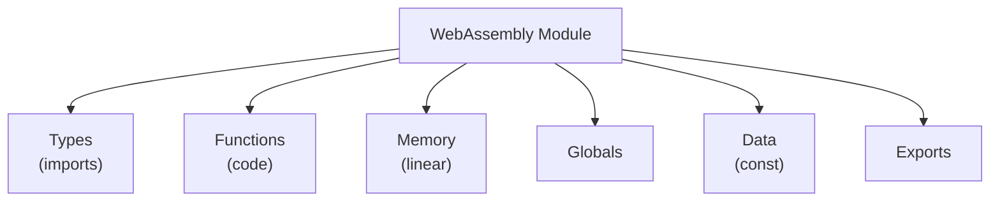
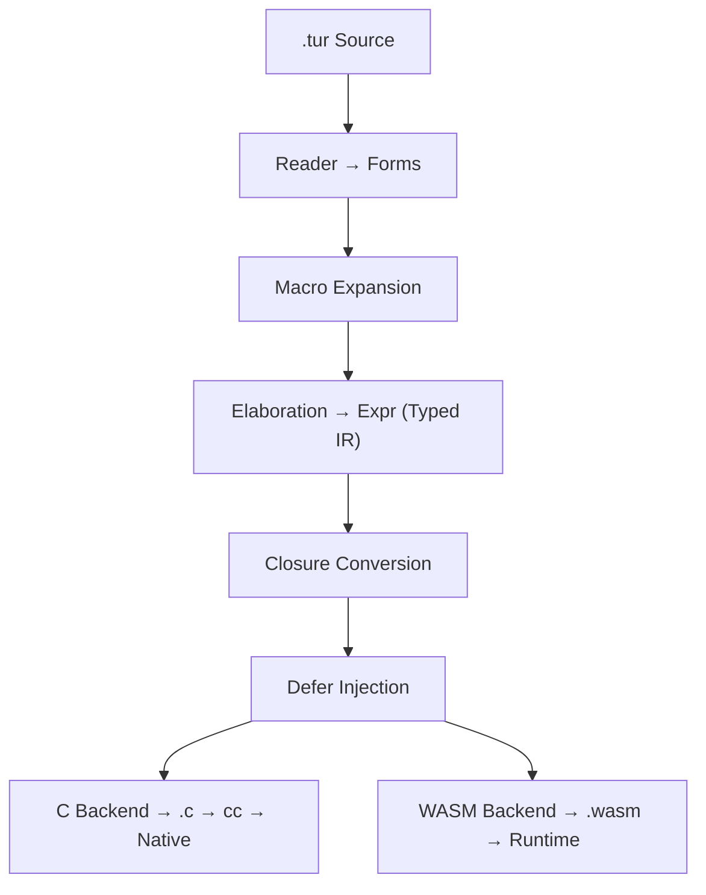
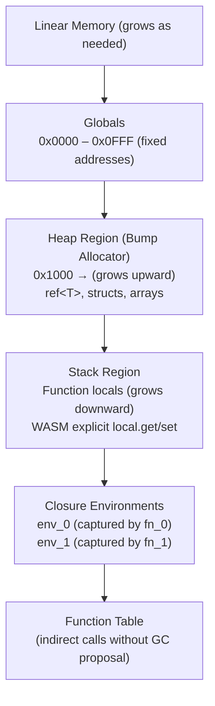

# Direct WebAssembly Generation Plan for Turmeric

> *Bypassing C to compile Turmeric directly to WebAssembly*

---

## Table of Contents

1. [Executive Summary](#executive-summary)
2. [Motivation](#motivation)
3. [Current Architecture](#current-architecture)
4. [WebAssembly Overview](#webassembly-overview)
5. [Technical Approach](#technical-approach)
6. [Implementation Phases](#implementation-phases)
7. [Detailed Design](#detailed-design)
8. [Type Mapping](#type-mapping)
9. [Memory Model](#memory-model)
10. [Closure Handling](#closure-handling)
11. [Defer & ref<T> in WASM](#defer--reft-in-wasm)
12. [FFI & Extern-C](#ffi--extern-c)
13. [Toolchain & Testing](#toolchain--testing)
14. [Risks & Mitigations](#risks--mitigations)
15. [Alternatives Considered](#alternatives-considered)
16. [Recommendations](#recommendations)

---

## Executive Summary

**Goal:** Add a WebAssembly (WASM) codegen backend to Turmeric, enabling direct compilation to `.wasm` without generating intermediate C code.

**Feasibility:** HIGH - Turmeric's typed IR (`Expr`) is already well-suited for WASM's strongly-typed, stack-based model.

**Effort Estimate:** 4-6 weeks for MVP (core types, functions, basic control flow), 8-12 weeks for full feature parity with C backend.

**Key Insight:** WASM's type system and execution model align surprisingly well with Turmeric's design. The main challenges are memory model differences (linear memory vs. C's stack/heap) and FFI.

---

## Motivation

### Why Direct WASM?

| Benefit | Details |
|---|---|
| **Web Deployment** | Run Turmeric code directly in browsers and WASM runtimes (Node.js, Wasmtime, Wasmer) |
| **Smaller Binaries** | WASM binaries are typically smaller than native ELF binaries |
| **Portability** | WASM runs consistently across all platforms |
| **Sandboxing** | WASM's linear memory model provides natural isolation |
| **Performance** | Avoid C compilation step, direct emission of optimized WASM |
| **No C Compiler Needed** | Cross-compilation without target-specific toolchains |
| **WASI Support** | Access to WASI (WebAssembly System Interface) for filesystem, etc. |

### Why Not C-to-WASM?

Compiling C to WASM (via Emscripten) works but has issues:
- Emscripten adds ~2MB runtime overhead
- C-to-WASM compilation is slow
- Loss of control over WASM-specific features (SIMD, bulk memory, etc.)
- Can't optimize for WASM's stack-based model
- No access to WASM-specific types (e.g., `externref`)

**Decision: Direct WASM generation is superior for Turmeric's use cases.**

---

## Current Architecture

```
Turmeric Source (.tur)
    ↓
Reader → Forms (AST)
    ↓
Macro Expansion
    ↓
Special-Form Lowering
    ↓
Type Checking/Elaboration → Expr (Typed IR)
    ↓
Closure Conversion
    ↓
Scope Analysis & Defer Injection
    ↓
C Codegen → .c files
    ↓
C Compiler (cc) → Native Binary
```

**Key Observation:** The `Expr` typed IR (produced by elaboration) is the perfect insertion point for WASM codegen. All type information, closure conversion, and defer injection are already handled.

---

## WebAssembly Overview

### WASM Model



### WASM Types (MVP)

| WASM Type | Size | Turmeric Equivalent |
|---|---|---|
| `i32` | 32-bit | `int` (truncated) |
| `i64` | 64-bit | `int` ✅ |
| `f32` | 32-bit IEEE | `float` (future) |
| `f64` | 64-bit IEEE | `float` (future) |
| `anyref` | Reference | `ptr<T>`, `ref<T>` (with GC proposal) |
| `externref` | Opaque ref | FFI pointers (future) |

### WASM Value Types (Extended)

- **Integer:** `i8`, `i16`, `i32`, `i64`, `u8`, `u16`, `u32`, `u64` (WASM only has signed, but we can use i* for all)
- **Float:** `f32`, `f64`
- **Vector:** `v128` (SIMD proposal)
- **Reference:** `funcref`, `externref` (GC and reference types proposals)

### WASM Instructions (Relevant Subset)

```wasm
;; Control flow
block    ;; create a block
loop     ;; create a loop
if       ;; conditional
br N     ;; branch to label N
br_if N  ;; conditional branch
return   ;; return from function
unreachable ;; trap

;; Stack operations
drop     ;; pop and discard
select   ;; conditional select

;; Integer operations (i64)
i64.const N    ;; push constant N
i64.add        ;; add two i64s
i64.sub        ;; subtract
i64.mul        ;; multiply
i64.div_s      ;; signed divide
i64.rem_s      ;; signed remainder
i64.eq         ;; equal
i64.ne         ;; not equal
i64.lt_s       ;; less than (signed)
i64.gt_s       ;; greater than (signed)
i64.le_s       ;; less than or equal
i64.ge_s       ;; greater than or equal

;; Memory operations
i64.load    ;; load i64 from memory
i64.store   ;; store i64 to memory
i64.load8_s ;; load signed 8-bit as i64
i64.store8  ;; store 8-bit from i64

;; Function operations
call N      ;; call function N
call_indirect ;; call via function table

;; Local variables
local.get N  ;; get local N
local.set N  ;; set local N
local.tee N  ;; get and set local N
```

---

## Technical Approach

### Architecture: Dual Backend



### Implementation Strategy

**Shared IR:** Keep `Expr` as the common IR. Both backends consume it.

**WASM Backend Structure:**
```c
// wasm.h
typedef struct WasmModule WasmModule;
typedef struct WasmFunction WasmFunction;
typedef struct WasmType WasmType;

WasmModule* wasm_module_new(void);
void wasm_module_free(WasmModule*);
void wasm_emit_module(WasmModule*, FILE* out);  // Text or binary format

// Lowering from Expr to WASM
void wasm_lower_expr(WasmModule*, Expr*, WasmEmitCtx*);
```

### Output Format: WASM Text Format (WAT) First

**Rationale:**
- Human-readable for debugging
- Easier to validate during development
- Can use `wat2wasm` to convert to binary
- Reference implementation in `wabt` library

**Future:** Direct binary emission for production (smaller, faster to load)

---

## Implementation Phases

### Phase W0: Foundation (1 week)

**Goal:** Basic WASM module generation with simple functions

**Tasks:**
- [ ] Create `src/wasm/` directory structure
- [ ] Implement WASM module/type/function data structures
- [ ] WAT emission for module header, type section, function section
- [ ] Basic type mapping (int → i64, bool → i32)
- [ ] Local variable handling
- [ ] Integer constant emission
- [ ] Integer arithmetic: `+`, `-`, `*`, `/`, `mod`
- [ ] Comparison operators: `=`, `!=`, `<`, `>`, `<=`, `>=`
- [ ] Boolean operations: `and`, `or`, `not`
- [ ] Control flow: `if`/`else` (no loops yet)
- [ ] Test fixture: `add.tur` → `add.wat` → verifiable with `wasm-validate`

**Exit Criterion:** `(defn add [a b] : int (+ a b))` compiles to valid WASM that can be executed in a WASM runtime.

---

### Phase W1: Memory Model (1 week)

**Goal:** Linear memory allocation and pointer operations

**Tasks:**
- [ ] Define linear memory layout
- [ ] Emit memory section with initial size
- [ ] Implement `tur_alloc` in WASM (grow linear memory as needed)
- [ ] `ref<T>` lowering: allocate in linear memory, store pointer as i64
- [ ] `@` dereference: load from linear memory
- [ ] `set!` for `^mut` bindings: store to linear memory
- [ ] Global variables (Turmeric `def` at module level → WASM globals)
- [ ] Test fixture: `counter-ref.tur` with `ref<int>`

**Memory Layout Design:**


Heap bump allocator:
- `tur_alloc` uses a global i64 offset
- Each allocation increments offset
- No free (defer handles cleanup via reset)

**Exit Criterion:** `(defn make-counter [] (ref 0))` compiles, counter can be incremented and dereferenced.

---

### Phase W2: Functions & Control Flow (1 week)

**Goal:** Full function support including recursion and loops

**Tasks:**
- [ ] Function declarations with proper WASM types
- [ ] Function calls (direct, not indirect yet)
- [ ] Recursive functions (WASM handles this natively)
- [ ] `while` loops → WASM `block` + `loop` + `br_if`
- [ ] `do` blocks
- [ ] `let` bindings → WASM locals
- [ ] Closure thunks as top-level WASM functions
- [ ] Test fixtures: `factorial.tur`, `fizzbuzz.tur`

**WASM Function Example:**
```wasm
;; Turmeric: (defn factorial [n] : int (if (<= n 1) 1 (* n (factorial (- n 1)))))
(type $factorial_type (func (param i64) (result i64)))
(func $factorial (type $factorial_type) (param $n i64) (result i64)
  local.get $n
  i64.const 1
  i64.le_s
  if (result i64)
    i64.const 1
  else
    local.get $n
    local.get $n
    i64.const 1
    i64.sub
    call $factorial
    i64.mul
  end)
```

**Exit Criterion:** Fizzbuzz compiles and runs correctly in WASM.

---

### Phase W3: Closures (1 week)

**Goal:** Full closure support with environment capture

**Challenges:**
- WASM has no native closures
- Need to implement closure structs and thunks manually
- Environment must be stored in linear memory

**Approach:**
1. Each closure becomes a struct in linear memory containing:
   - Function pointer (WASM `funcref` with GC proposal, or i64 index without)
   - Captured environment (fields for each captured variable)

2. Without GC proposal (MVP):
   - Use i64 indices into a function table
   - Closure struct: `{ env_ptr: i64, func_idx: i64 }`
   - Call via indirect table lookup

3. With GC proposal (future):
   - Use `funcref` for direct function references
   - Use `anyref` for environment pointers

**Tasks:**
- [ ] Closure env struct synthesis in WASM
- [ ] Closure thunk emission as separate WASM functions
- [ ] Closure creation: allocate env, store captured values
- [ ] Closure call: load env pointer, pass to thunk
- [ ] Nested closures
- [ ] Test fixtures: `counter-closure.tur`, `adder-factory.tur`

**Exit Criterion:** `(defn make-counter [start] (fn [] (set! start (+ start 1)) start))` works.

---

### Phase W4: Defer & Scope Management (1 week)

**Goal:** Implement Turmeric's `defer` semantics in WASM

**Challenges:**
- WASM has no built-in exception handling
- `defer` requires cleanup on all exit paths
- Need to track scope nesting

**Approach:**
1. Each scope with defers gets a cleanup function
2. On normal exit: call cleanup
3. On early return: call cleanup before returning
4. On branch out: call cleanup before branching

**Implementation:**
- Use WASM `block` labels for scope boundaries
- Emit cleanup code at each exit point
- LIFO ordering via explicit call sequence

**Tasks:**
- [ ] Scope tracking in WASM backend
- [ ] Defer registration
- [ ] Cleanup thunk emission
- [ ] Insert cleanup calls at all exit points
- [ ] `ref<T>` auto-defer integration
- [ ] Test fixtures: `defer-basic.tur`, `defer-nested.tur`

**Exit Criterion:** Defer ordering tests pass (LIFO, early return, nested scopes).

---

### Phase W5: FFI & WASI (1 week)

**Goal:** External function calls and WASI support

**Tasks:**
- [ ] `extern-c` declarations → WASM import declarations
- [ ] Built-in externs: `malloc`, `free`, `printf` via WASI or JS imports
- [ ] WASI support for basic I/O
- [ ] `println` via WASI `fd_write` or browser `console.log`
- [ ] Inline C blocks: Error or ignore for WASM target
- [ ] Test fixtures: `hello-wasi.tur`, `printf-test.tur`

**WASI Example:**
```wasm
;; Import WASI functions
(import "wasi_snapshot_preview1" "fd_write" (func $fd_write (param i32 i32 i32 i32) (result i32)))

;; Turmeric: (println "hello")
(func $println (param $ptr i32) (param $len i32)
  i32.const 1  ;; stdout fd
  local.get $ptr
  local.get $len
  i32.const 0  ;; where to write (nwritten)
  call $fd_write
  drop  ;; ignore result
)
```

**Exit Criterion:** `(println "Hello, WASM!")` works in both WASI and browser environments.

---

### Phase W6: Float Support (Optional, 3-5 days)

**Goal:** Add floating-point type support

**Tasks:**
- [ ] `float` type → WASM `f64`
- [ ] Float constants
- [ ] Float arithmetic: `+`, `-`, `*`, `/`
- [ ] Float comparison
- [ ] Float ↔ Integer conversion
- [ ] Test fixtures: `float-arith.tur`

**Exit Criterion:** Basic float operations compile and execute.

---

### Phase W7: Binary WASM Output (Optional, 3-5 days)

**Goal:** Direct binary WASM emission (instead of WAT text format)

**Tasks:**
- [ ] Implement binary WASM encoder
- [ ] Module header encoding
- [ ] Type section encoding
- [ ] Function section encoding
- [ ] Code section encoding
- [ ] Memory/Global/Data section encoding
- [ ] Export section encoding
- [ ] Performance benchmarking vs WAT

**Exit Criterion:** Binary WASM output is valid and smaller than WAT → binary conversion.

---

### Phase W8: Optimization (Optional, Ongoing)

**Goal:** Improve generated WASM quality

**Tasks:**
- [ ] Dead code elimination
- [ ] Constant folding
- [ ] Common subexpression elimination
- [ ] Loop optimizations
- [ ] Inlining of small functions
- [ ] Tail call optimization (WASM supports this natively)
- [ ] Memory access optimization

---

## Detailed Design

### WASM Backend Module Structure

```c
// src/wasm/wasm.h
#ifndef TURMERIC_WASM_H
#define TURMERIC_WASM_H

#include "expr.h"
#include "type.h"

typedef enum {
    WASM_I32,
    WASM_I64,
    WASM_F32,
    WASM_F64,
    WASM_FUNC_REF,  // GC proposal
    WASM_ANY_REF,   // GC proposal
} WasmType;

typedef struct WasmValueType {
    WasmType type;
} WasmValueType;

typedef struct WasmFuncType {
    WasmValueType* params;
    size_t param_count;
    WasmValueType* results;
    size_t result_count;
} WasmFuncType;

typedef struct WasmFunction {
    Sym* name;
    WasmFuncType type;
    bool is_import;
    bool is_export;
    // For code generation
    Vec(Vec8) body;  // Binary WASM or text WAT
} WasmFunction;

typedef struct WasmModule {
    Vec(WasmFuncType*) types;
    Vec(WasmFunction*) funcs;
    Vec(WasmFunction*) imports;
    Vec(WasmFunction*) exports;
    
    // Memory
    uint64_t memory_min;
    uint64_t memory_max;
    
    // Globals
    Vec(WasmGlobal*) globals;
    
    // Data segments
    Vec(WasmDataSegment*) data_segments;
    
    // Custom sections (name, etc.)
    Vec(WasmCustomSection*) custom_sections;
} WasmModule;

typedef struct WasmEmitCtx {
    WasmModule* module;
    WasmFunction* current_func;
    Vec(Local*) locals;
    LabelStack* label_stack;  // For block/loop/if
    ScopeStack* scope_stack; // For defer tracking
    
    // Type state
    Type* current_expr_type;
    
    // Memory allocator offset
    uint64_t heap_offset;
} WasmEmitCtx;

WasmModule* wasm_module_new(void);
void wasm_module_free(WasmModule*);

// Emission
void wasm_emit_text(WasmModule*, FILE* out);
void wasm_emit_binary(WasmModule*, FILE* out);

// Lowering
void wasm_lower_module(WasmModule*, Module* tur_module);
void wasm_lower_expr(WasmEmitCtx*, Expr* expr);

#endif
```

### Code Generation Context

```c
typedef struct WasmCodegenCtx {
    WasmEmitCtx* emit;
    
    // Label management
    int label_counter;
    
    // Local variable tracking
    int local_counter;
    Map* local_map;  // Binding* → local index
    
    // For closure handling
    int closure_counter;
    Map* closure_env_types;  // Closure ID → env struct type
    
    // For defer handling
    Vec(DeferInfo*) defers;
    int scope_depth;
} WasmCodegenCtx;
```

### Expression Lowering

```c
void wasm_lower_expr(WasmEmitCtx* ctx, Expr* expr) {
    switch (expr->kind) {
        case EX_INT:
            wasm_emit_i64_const(ctx, expr->int_val);
            break;
            
        case EX_BOOL:
            wasm_emit_i32_const(ctx, expr->bool_val ? 1 : 0);
            break;
            
        case EX_VAR:
            wasm_emit_local_get(ctx, wasm_lookup_binding(ctx, expr->var));
            break;
            
        case EX_BINOP:
            wasm_lower_expr(ctx, expr->binop.lhs);
            wasm_lower_expr(ctx, expr->binop.rhs);
            wasm_emit_binop(ctx, expr->binop.op);
            break;
            
        case EX_CALL:
            wasm_lower_call(ctx, expr);
            break;
            
        case EX_IF:
            wasm_lower_if(ctx, expr);
            break;
            
        case EX_LET:
            wasm_lower_let(ctx, expr);
            break;
            
        case EX_FN:
        case EX_CLOSURE:
            wasm_lower_closure(ctx, expr);
            break;
            
        // ... etc
    }
}
```

---

## Type Mapping

### Scalar Types

| Turmeric | WASM | Notes |
|---|---|---|
| `int` | `i64` | Natural fit |
| `bool` | `i32` | 0 = false, 1 = true |
| `float` | `f64` | Future |
| `char` | `i32` | Unicode code point |
| `cstr` | `i32` | Pointer offset into linear memory |
| `ptr<T>` | `i64` | Raw offset in linear memory |
| `ref<T>` | `i64` | Offset to heap-allocated T |
| `nil` | (none) | No value, or use `i32` with special value |

### Aggregate Types

| Turmeric | WASM | Lowering Strategy |
|---|---|---|
| `struct` | None | Flatten to fields, use memory offsets |
| `array<T, N>` | None | Contiguous memory, size = N * sizeof(T) |
| `slice<T>` | None | `{ptr: i64, len: i64}` in memory |
| `vec<T>` | None | `{data: i64, len: i64, cap: i64}` in memory |
| `str` | None | `{ptr: i64, len: i64}` in memory |

### Function Types

| Turmeric | WASM | Notes |
|---|---|---|
| `(fn [T1 T2] : R)` | `(func (param T1 T2) (result R))` | Direct mapping |
| Closure | None | Struct + thunk function |

---

## Memory Model

### Linear Memory Layout



### Memory Management Strategy

**Heap Allocation (Bump Allocator):**
```c
;; WASM global for heap pointer
(global $__tur_heap_ptr (mut i64) i64.const 0x1000)

;; tur_alloc implementation in WASM
(func $tur_alloc (param $size i64) (result i64)
  global.get $__tur_heap_ptr
  local.tee $result  ;; save current pointer
  local.get $size
  i64.add
  global.set $__tur_heap_ptr  ;; advance pointer
  local.get $result
)
```

**For `ref<T>`:**
```c
;; ref<T> is just a pointer to heap-allocated memory
;; tur_alloc(sizeof(T)) returns the offset
;; @r dereferences: load from that offset
;; drop! r: no-op (memory reused by bump alloc reset)
```

**For `defer`:**
- Defer cleanup is registered in a per-scope list
- On scope exit, cleanup functions are called in LIFO order
- Cleanup functions reset bump allocator for their scope

---

## Closure Handling

### Without GC Proposal (MVP)

**Representation:**
```
Closure in memory:
┌─────────────────────┐
│ func_idx: i64        │  Index into function table
│ env_ptr: i64         │  Pointer to environment struct
└─────────────────────┘

Environment struct (for each closure):
┌─────────────────────┐
│ field_0: T0         │  Captured variable 0
│ field_1: T1         │  Captured variable 1
│ ...                 │
└─────────────────────┘
```

**Call Sequence:**
```wasm
;; Closure value is on stack: {func_idx, env_ptr}
;; Call it with arguments

;; Load env_ptr
local.get $closure
i64.const 8  ;; offset of env_ptr field
i64.add
i64.load

;; Push arguments
... arguments ...

;; Push env_ptr as first argument
;; (thunk expects env as first param)

;; Look up function by index
local.get $closure
i64.const 0  ;; offset of func_idx field
i64.add
i64.load

;; Call via table
call_indirect $type_closure_call
```

### With GC Proposal (Future)

**Representation:**
```
Closure in memory:
┌─────────────────────┐
│ func_ref: funcref   │  Direct function reference
│ env_ref: anyref     │  Environment reference
└─────────────────────┘
```

**Advantages:**
- Direct function calls (no table lookup)
- GC tracks closure objects
- More efficient

---

## Defer & ref<T> in WASM

### Defer Implementation

**Strategy:** Use WASM `block` labels and explicit cleanup calls.

```clojure
;; Turmeric
(defn foo []
  (let [x (ref 42)]
    (defer (println "cleanup"))
    (println "body")))
```

```wasm
(func $foo
  ;; Allocate ref
  i64.const 8  ;; sizeof(i64)
  call $tur_alloc
  local.set $x_ptr
  i64.const 42
  i64.store
  
  ;; Register defer
  ;; Push cleanup thunk to defer stack
  
  block $cleanup_block
    ;; Body
    local.get $x_ptr
    i64.load
    call $println_int
    
    ;; Normal exit: run cleanup
    call $__tur_run_defers
    return
  end
  
  ;; Early exit paths would also call $__tur_run_defers
)
```

### Scope Stack Implementation

```c
typedef struct WasmDefer {
    Sym* cleanup_func;  // Function to call
    Vec(Expr*) args;    // Arguments to pass
} WasmDefer;

typedef struct WasmScope {
    Vec(WasmDefer*) defers;
    int label_idx;  // WASM block label for this scope
    struct WasmScope* parent;
} WasmScope;
```

**Cleanup Function:**
```wasm
(func $__tur_run_defers
  ;; Walk the defer stack for current scope
  ;; Call each cleanup function in LIFO order
  ...
)
```

---

## FFI & Extern-C

### WASM Import/Export

**`extern-c` Declaration:**
```clojure
(extern-c printf [^cstr fmt & args] : int)
```

**WASM Import:**
```wasm
(module
  ;; Import printf from env
  (import "env" "printf" (func $printf (param i32 i64) (result i32)))
  ...
)
```

### WASI Support

**Two Approaches:**

1. **WASI Preview 1:** Standardized syscalls
   - `wasi_snapshot_preview1` namespace
   - File I/O, random, time, etc.
   - Good for server-side WASM

2. **Browser:** JS imports
   - Import JS functions directly
   - Use `console.log` for output
   - Good for web deployment

**Unified Approach:**
```clojure
;; Target-agnostic externs
(extern-c println [^cstr s] : void)
```

**WASI Implementation:**
```wasm
(import "wasi_snapshot_preview1" "fd_write" (func $fd_write ...))
(func $println (param $ptr i32) (param $len i32)
  ... call fd_write ...
)
```

**Browser Implementation:**
```wasm
(import "env" "__tur_println" (func $js_println (param i32 i32)))
(func $println (param $ptr i32) (param $len i32)
  local.get $ptr
  local.get $len
  call $js_println
)
```

### Inline C Blocks

**Approach:** Error or ignore for WASM target

```clojure
;; This would error when targeting WASM
(defn foo []
  ```c
  return __builtin_popcount(x);
  ```)
```

**Alternative:** Define WASM intrinsics
```clojure
;; Future: WASM-specific intrinsics
(extern-wasm popcount [^int x] : int)
```

---

## Toolchain & Testing

### Development Tools

| Tool | Purpose |
|---|---|
| `wabt` | WAT ↔ WASM conversion, validation |
| `wasm-opt` | WASM optimization (from Binaryen) |
| `wasmtime` | WASM runtime for testing |
| `node` | Browser-like WASM execution |
| `wasm-validate` | Binary WASM validation |
| `wasi-test` | WASI testing |

### Build Integration

**New CLI Flags:**
```bash
tur build foo.tur --target wasm    # Output foo.wasm (binary)
tur build foo.tur --target wat    # Output foo.wat (text)
tur build foo.tur --target wasi   # WASI-enabled WASM
tur run foo.tur --target wasm     # Run with wasmtime
```

### Test Strategy

1. **Unit Tests:** Individual WASM instructions
2. **Integration Tests:** Full programs
3. **WASI Tests:** Filesystem, etc.
4. **Browser Tests:** Web deployment
5. **Validation:** All output passes `wasm-validate`
6. **Comparison:** WASM output matches C output for same logic

**Test Fixtures:**
- `wasm/hello.wat` - Basic hello world
- `wasm/arith.wat` - Arithmetic operations
- `wasm/fizzbuzz.wat` - Control flow
- `wasm/counter.wat` - ref<T> and mutation
- `wasm/closure.wat` - Closures
- `wasm/defer.wat` - Scope-based cleanup

---

## Risks & Mitigations

| Risk | Likelihood | Impact | Mitigation |
|---|---|---|---|
| WASM GC proposal not stable | Medium | Medium | Implement without GC first, upgrade later |
| Performance worse than C | Low | Low | WASM JIT is highly optimized |
| Binary size too large | Low | Medium | Use binary format, wasm-opt |
| Memory model limitations | Medium | High | Careful design of allocator |
| FFI complexity | High | Medium | Start with minimal FFI, expand |
| Closure performance | Medium | Medium | Use function table, not indirect calls |
| Defer implementation bugs | High | High | Extensive testing with WASM-validate |
| Target-specific code needed | High | Medium | Use compiler flags, #ifdef-style |
| WASM spec changes | Low | Low | Target stable WASM MVP spec |

---

## Alternatives Considered

### Alternative 1: C-to-WASM via Emscripten

**Pros:**
- Quick to implement
- Reuse existing C backend
- Full feature compatibility

**Cons:**
- 2MB+ runtime overhead
- Slow compilation
- No WASM-specific optimizations
- No access to WASM features (SIMD, GC, etc.)

**Verdict:** REJECTED - Defeats the purpose of direct WASM

---

### Alternative 2: LLVM WASM Backend

**Approach:** Generate LLVM IR, then use LLVM's WASM backend

**Pros:**
- Mature, well-tested WASM generation
- Good optimization
- Shared IR between C and WASM backends

**Cons:**
- Heavy dependency (LLVM)
- Complex integration
- Less control over WASM-specific features
- Build complexity

**Verdict:** POSSIBLE FUTURE - But direct WASM is simpler for now

---

### Alternative 3: Rust as Intermediate

**Approach:** Generate Rust code, compile to WASM via rustc

**Pros:**
- Rust has excellent WASM support
- Good optimization

**Cons:**
- Rust dependency
- Two compilation steps
- Less control
- Semantic mismatches

**Verdict:** REJECTED - Too indirect

---

### Alternative 4: Cranelift Backend

**Approach:** Use Cranelift's WASM backend

**Pros:**
- Lightweight
- Good WASM support
- Can use for other targets too (native code)

**Cons:**
- Additional dependency
- Integration effort

**Verdict:** FUTURE OPTION - Good for multi-target compilation

---

## Recommendations

### Immediate (Next 2-3 Months)

1. **Implement Phase W0-W2** (Foundation, Memory, Functions)
   - Get basic WASM generation working
   - Validate with simple programs
   - Priority: MVP that can run fizzbuzz

2. **Integrate with build system**
   - Add `--target wasm` flag
   - Set up WASM toolchain in CI
   - Add validation to test suite

3. **Document WASM limitations**
   - Note which features don't work yet
   - Document FFI differences
   - Provide workarounds

### Short Term (3-6 Months)

4. **Complete Phase W3-W5** (Closures, Defer, FFI)
   - Full language support for WASM
   - WASI integration
   - Browser support

5. **Add binary output**
   - Reduce file size
   - Faster loading

6. **Optimization passes**
   - Basic dead code elimination
   - Constant folding

### Long Term (6-12 Months)

7. **Advanced features**
   - GC proposal support (when stable)
   - SIMD instructions
   - Bulk memory operations
   - Exception handling proposal

8. **Multi-target compilation**
   - Single compilation to both native and WASM
   - Shared IR between backends
   - Consider Cranelift for native codegen

---

## Success Criteria

| Phase | Criteria |
|---|---|
| W0 | Basic functions compile to valid WAT, pass wasm-validate |
| W1 | Memory operations work, ref<T> compiles |
| W2 | Fizzbuzz compiles and runs correctly |
| W3 | Closures work, counter example runs |
| W4 | Defer works, cleanup happens in LIFO order |
| W5 | println works via WASI or browser |
| W6 | Float types work |
| W7 | Binary output is valid and smaller than WAT |

---

## Resources

- [WebAssembly Specification](https://webassembly.github.io/spec/)
- [WASM Text Format](https://webassembly.github.io/spec/core/text/index.html)
- [WASM Binary Format](https://webassembly.github.io/spec/core/binary/index.html)
- [WABT (Tools)](https://github.com/WebAssembly/wabt)
- [Binaryen (Optimizer)](https://github.com/WebAssembly/binaryen)
- [WASI](https://wasi.dev/)
- [Wasmtime (Runtime)](https://wasmtime.dev/)
- [MDN WASM Guide](https://developer.mozilla.org/en-US/docs/WebAssembly)
- [GC Proposal](https://github.com/WebAssembly/gc)
- [Component Model](https://github.com/WebAssembly/component-model)

---

## Appendix: Example WASM Output

### Turmeric Source

```clojure
(defn factorial [n] : int
  (if (<= n 1)
    1
    (* n (factorial (- n 1)))))

(defn main []
  (println (factorial 5)))
```

### Generated WAT (Simplified)

```wasm
(module
  ;; Type definitions
  (type $int_to_int (func (param i64) (result i64)))
  (type $void_to_void (func))
  
  ;; Memory
  (memory 1 10)
  
  ;; Global for heap pointer
  (global $__tur_heap_ptr (mut i64) i64.const 0x1000)
  
  ;; tur_alloc
  (func $tur_alloc (param $size i64) (result i64)
    global.get $__tur_heap_ptr
    local.tee $result
    local.get $size
    i64.add
    global.set $__tur_heap_ptr
    local.get $result
  )
  
  ;; factorial
  (func $factorial (type $int_to_int) (param $n i64) (result i64)
    local.get $n
    i64.const 1
    i64.le_s
    if (result i64)
      i64.const 1
    else
      local.get $n
      local.get $n
      i64.const 1
      i64.sub
      call $factorial
      i64.mul
    end
  )
  
  ;; println for int (simplified - calls WASI)
  (func $println_int (param $val i64)
    ;; Convert to string (omitted)
    ;; Call fd_write (omitted)
  )
  
  ;; main
  (func $main (type $void_to_void)
    i64.const 5
    call $factorial
    call $println_int
  )
  
  ;; Export main for WASI
  (export "_start" (func $main))
)
```

---

## Conclusion

Direct WASM generation is **highly feasible** for Turmeric and would provide significant benefits:

1. **Web deployment** without Emscripten overhead
2. **Cross-platform** compilation
3. **Smaller binaries** and faster startup
4. **Access to WASM ecosystem** (WASI, browsers, etc.)

**Implementation Plan:**
- Start with WAT text format for debugging
- Implement phases W0-W5 for full language support
- Add binary output later
- Consider Cranelift for native codegen to share IR

**Effort:** 4-6 weeks for MVP, 8-12 weeks for full feature parity.

**Recommendation:** PROCEED - The alignment between Turmeric's typed IR and WASM's type system makes this a natural fit. The main challenges (memory model, closures) have clear solutions.
